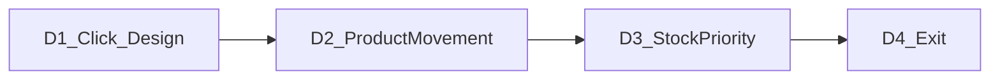

# Owner Dashboard Intelligence — Enhancement Execution Plan

**Document type:** Fresh-chat execution guide for the **Dashboard Intelligence enhancement track** (Owner web only).  
**Track kind:** **Separate enhancement** — not a Production Remaining wave; does **not** replace Wave 5 / Wave 6.  
**Master index (pointer):** [`PRODUCTION_REMAINING_EXECUTION.md`](PRODUCTION_REMAINING_EXECUTION.md) § Side enhancement tracks  
**Source of truth:** [`PROJECT_MASTER_PLAN.md`](PROJECT_MASTER_PLAN.md)  
**Live progress:** [`Current_Status.md`](Current_Status.md)  
**API catalog:** [`Completed_API_lists.md`](Completed_API_lists.md)  
**RBAC:** [`ROLES_AND_PERMISSIONS.md`](ROLES_AND_PERMISSIONS.md)  
**Authorized plan:** Dashboard Intelligence Track (2026-09-18)

**Status of this track:** **DONE** (D1–D4) — 2026-09-19. Resume production: `Authorize Prod Batch S1`.
**Prerequisite:** Owner Dashboard live (M6 G); Inventory tabs API live; Sales `?from=&to=` live; Reports hub live (`/reports`, `/reports/sales`, `/reports/inventory`, `/reports/purchasing`).  
**Official Production next (unchanged):** `Authorize Prod Batch S1` ([`PROD_WAVE_5_STUBS_EXECUTION.md`](PROD_WAVE_5_STUBS_EXECUTION.md)).

**Do not start from this file:** forecasting/ML · n8n · push/email alerts · Manager web · desktop POS surfaces · bi-di sync · Postgres RLS · M7 · **Baki / on-account / customer credit / due / receivable tender**.

---

## Why this track exists

Owner Dashboard today shows live KPIs but most tiles are **display-only**. Inventory health counts cannot deep-link into filtered inventory. There is **no** full product demand / low-sell record, and stock attention is **threshold-only** (low/out/expiry) — not **sale-priority** (high demand × thin cover).

This enhancement closes that gap in four batches:

| Need | Batch |
|------|--------|
| Clickable stats → correct paths + dashboard visual upgrade | **D1** |
| Professional product movement record (high demand / low sell) + 3/6 month filters | **D2** |
| Sale-priority stock alarms on Dashboard | **D3** |
| Catalog / status / composed smoke exit | **D4** |

---

## How to use

1. Fresh Cursor chat per batch **D1 → D2 → D3 → D4** (**fixed order**).
2. Attach: this file + [`PRODUCTION_REMAINING_EXECUTION.md`](PRODUCTION_REMAINING_EXECUTION.md) + [`Current_Status.md`](Current_Status.md) + [`PROJECT_MASTER_PLAN.md`](PROJECT_MASTER_PLAN.md) + [`ROLES_AND_PERMISSIONS.md`](ROLES_AND_PERMISSIONS.md) + [`Completed_API_lists.md`](Completed_API_lists.md).
3. Say exactly: `Authorize Enhance Batch D<n>`.
4. Agent implements **only** that batch.
5. Short report → YOU DO → mark checkboxes / changelog → next chat.

> **Hard rules:**
> - **One batch per chat.** Never collapse D1–D4.
> - **OWNER-only** for all new APIs (existing `ownerRouter` + `restrictTo("OWNER")`). Manager/Cashier → **403**.
> - **No invented KPI/table rows.** Live Prisma via Express only.
> - Payments remain **`CASH` \| `CARD` \| `MFS` only.**  
>   **NEVER invent Baki** (also never: on-account, customer credit, due, receivable, “pay later”, credit ledger columns, or credit filters).
> - **Do not translate** medicine/product names, generics, manufacturers, SKUs, batch numbers, phones, barcodes, cashier/customer names.
> - Numbers stay **Latin digits 0–9** in all locales.
> - UI strings → `t("...")` + [`apps/web/src/i18n/locales/en.ts`](apps/web/src/i18n/locales/en.ts) + [`bn-BD.ts`](apps/web/src/i18n/locales/bn-BD.ts).
> - Scope = **Owner web** (`apps/web`) + owner APIs (`apps/server` owner module) + Zod in `@r2a/shared-types`. **No** desktop POS work in D1–D4.
> - Reuse existing low/out/expiry formulas — do **not** invent a second stock-threshold system.
> - Design invent is allowed for Dashboard (and new report page) **to match existing Owner theme** (teal primary, canvas tokens) — **no** new purple/cream/newspaper themes; **no** global font swap that breaks other pages.

---

## Short-report format

```text
## Enhance Batch <ID> report
Done: <1–3 bullets>
Smoke: PASS | FAIL | n/a — <name>
YOU DO: <numbered, or none>
Next: Authorize Enhance Batch <next>
```

After **D4:** `Next: resume Authorize Prod Batch S1` (if Wave 5 not finished) **or** continue production track as status says.

---

## Batch overview

| Batch | Title | Depends | Smoke |
|-------|-------|---------|-------|
| **D1** | Clickable KPIs + inventory `?tab=` + Dashboard design | Track auth | `smoke:enhance-d1` |
| **D2** | Product movement report API + UI (30/90/180) | D1 | `smoke:enhance-d2` |
| **D3** | Sale-priority stock alarms (API + Dashboard panel) | D2 | `smoke:enhance-d3` |
| **D4** | Track exit — catalog, status, composed smoke | D3 | `smoke:enhance-dash-intel` |

Order: **D1 → D2 → D3 → D4**.



---

## Locked business vocabulary (pharmacy)

All movement / priority windows use **UTC day** bounds (same style as existing owner `from`/`to` helpers).

### Range presets

| Preset | Meaning | Span |
|--------|---------|------|
| `last30` | Last 30 days incl. today | short ops |
| `last90` | **3 months** | primary demand window |
| `last180` | **6 months** | long demand window |

Dashboard home range selector may keep existing `today` / `last7` / `last30` for sales chart KPIs — **do not remove**. Movement + priority UIs use `last30` / `last90` / `last180`.

### Per-product metrics in `[from, to]`

| Field | Definition |
|-------|------------|
| `unitsSold` | `sum(SaleItem.quantityBase)` (PIECE) |
| `revenue` | `sum(SaleItem.lineTotal)` |
| `txnCount` | distinct `saleId` |
| `avgDailyUnits` | `unitsSold / max(1, spanDays)` |
| `onHand` | `sum(Batch.quantityOnHand)` store-scoped (same tenant rules as inventory list) |
| `reorderLevel` | `Product.reorderLevel` (nullable) |
| `daysOfCover` | `onHand / avgDailyUnits` if `avgDailyUnits > 0`, else `null` |
| `stockStatus` | see stock rules below |

### Canonical stock status (do not reinvent)

| Status | Rule |
|--------|------|
| `out` | active product, `onHand === 0` |
| `low` | `reorderLevel != null` AND `0 < onHand ≤ reorderLevel` |
| `healthy` | has sellable stock and not `low` / not forced out |
| `no_threshold` | `reorderLevel == null` and `onHand > 0` (never counts as low in owner inventory) |

### Demand bands

Rank **only among active products with `unitsSold > 0`** in the window (sort: `unitsSold` DESC, tie-break `revenue` DESC, then name ASC).

| Band | Rule | Business meaning |
|------|------|------------------|
| `high_demand` | Top **20%** of sellers | On demand / fast movers |
| `steady` | Middle **60%** of sellers | Normal movers |
| `low_sell` | Bottom **20%** of sellers | Low sell / slow movers |
| `no_sales` | `unitsSold === 0` AND `onHand > 0` | Stock sitting idle (review) |

**Omit from movement table by default:** `unitsSold === 0` AND `onHand === 0` (noise). Priority API still surfaces **out + high historical demand** via P1 using the seller ranking from the same window (products that sold in-window then went out, or out with prior sales in window).

If fewer than 5 sellers exist in-window, still apply percentile cutoffs on that small set (document in API meta: `sellerCount`).

### Sale-priority alarm levels

| Priority code | When | Owner should |
|---------------|------|--------------|
| `P1_restock_now` | `high_demand` + `out` | Restock immediately |
| `P2_restock_soon` | `high_demand` + (`low` OR `daysOfCover < 7`) | Restock soon |
| `P3_watch_cover` | `high_demand` + `daysOfCover != null` + `daysOfCover < 14` (and not already P1/P2) | Watch cover |
| `P4_review_slow` | (`low_sell` OR `no_sales`) + `onHand > 0` | Review slow / idle stock |

**Sort:** P1 → P2 → P3 → P4, then higher `avgDailyUnits` within level.  
**Dashboard panel:** top **8** rows. Full list via priority API `limit` (default 25) and/or Product Movement report.

A product matches **at most one** priority (highest wins).

---

## What exists today (reuse — do not reinvent)

| Asset | Path / API | Role in this track |
|-------|------------|--------------------|
| Dashboard UI | [`apps/web/src/features/dashboard/DashboardPage.tsx`](apps/web/src/features/dashboard/DashboardPage.tsx) | D1 clicks + design; D3 priority panel |
| Dashboard client | [`apps/web/src/lib/ownerDashboard.ts`](apps/web/src/lib/ownerDashboard.ts) | Keep; optional thin client for priority |
| Dashboard API | `GET /api/v1/owner/dashboard` | Keep as-is for sales/inventory health KPIs |
| Inventory list UI | [`apps/web/src/features/inventory/InventoryPage.tsx`](apps/web/src/features/inventory/InventoryPage.tsx) | D1: sync `?tab=` like `?supplierId=` |
| Inventory API | `GET /api/v1/owner/inventory?tab=…` | Already supports `all\|low\|out\|expiring30\|expiring90\|expired` |
| Sales list | [`apps/web/src/features/sales/SalesPage.tsx`](apps/web/src/features/sales/SalesPage.tsx) | Already reads `?from=&to=` |
| Sales report | `GET /api/v1/owner/reports/sales` + [`SalesReportPage.tsx`](apps/web/src/features/reports/SalesReportPage.tsx) | Has `topSellingMedicines` (top 10) — **extract shared aggregation** in D2 |
| Owner service | [`apps/server/src/modules/owner/owner.service.ts`](apps/server/src/modules/owner/owner.service.ts) | New report services + shared helper |
| Owner router | [`apps/server/src/modules/owner/owner.router.ts`](apps/server/src/modules/owner/owner.router.ts) | Mount new GETs |
| Shared Zod | [`packages/shared-types/src/owner.ts`](packages/shared-types/src/owner.ts) | New query/response schemas |
| Theme tokens | [`apps/web/src/styles/index.css`](apps/web/src/styles/index.css) | Teal / canvas — design stays inside tokens |
| App shell routes | [`apps/web/src/features/shell/AppShell.tsx`](apps/web/src/features/shell/AppShell.tsx) | Register `/reports/product-movement` |
| Reports hub | [`apps/web/src/features/reports/ReportsDashboardPage.tsx`](apps/web/src/features/reports/ReportsDashboardPage.tsx) | Link to movement report |
| CSV helper | [`apps/web/src/lib/csvExport.ts`](apps/web/src/lib/csvExport.ts) | D2 export |

---

## Locked deep-link matrix (D1)

| Dashboard widget | Navigate to | Notes |
|------------------|-------------|--------|
| Today’s sales | `/sales?from={today}&to={today}` | UTC YMD |
| Transactions | `/sales?from={today}&to={today}` | same |
| Avg sale | `/sales?from={today}&to={today}` | same |
| Net profit | `/reports/sales` | sales report already shows profit KPIs |
| Inventory health: Low stock | `/inventory?tab=low` | requires D1 URL sync |
| Inventory health: Out of stock | `/inventory?tab=out` | |
| Inventory health: Expiring 30d | `/inventory?tab=expiring30` | |
| Inventory health: Expiring 90d | `/inventory?tab=expiring90` | |
| Attention: Out of stock | `/inventory?tab=out` | upgrade from bare `/inventory` |
| Attention: Expiring 30d | `/inventory/expiry` | keep specialised expiry page |
| Staff: cash variance | `/staff/shifts` | enable / wire |
| Staff: active cashiers | `/staff/shifts` | |
| Staff: open shifts (if shown) | `/staff/shifts` | show if payload has `openShifts` and UX fits |
| FEFO overrides (today/week) | `/audit` | |
| FEFO “View audit” CTA | `/audit` | **enable** (currently disabled) |
| “View reports” CTA | `/reports` | **enable** |
| View all sales | `/sales` | already live |
| Recent sale row | `/sales/{id}` | already live |
| Terminals presence card | *(none)* | informational only |
| Sales overview chart bars | *(none in D1)* | no day drill-down |

Keyboard: clickable tiles are real `<button>` (or equivalent) — **Enter** activates; do **not** introduce Tab-as-POS-nav copy (Owner web may use normal web focus; no `[Tab] Navigate` labels).

---

## Design invent lock (D1 + later polish)

**Surface:** [`DashboardPage.tsx`](apps/web/src/features/dashboard/DashboardPage.tsx) (+ shared small presentational bits used only by dashboard if extracted).

**Invent (agent decides exact values):**

- Stronger page title hierarchy (`text-3xl` or equivalent) + clearer section labels
- Larger KPI value type with tabular lining numerals where practical
- Tighter vertical rhythm / denser but readable grid
- Clearer hover/focus rings on clickable tiles (primary teal focus)
- Attention / priority areas read as “act now” without loud emoji or purple glow

**Do not:**

- Change global `--font-sans` for the whole app
- Introduce a second color system
- Redesign sidebar / shell chrome
- Restyle Sales / Inventory / other pages in D1 (only what’s required for `?tab=` deep-link)

New Product Movement page (D2) and Priority panel (D3) **match** the upgraded dashboard visual language.

---

## API contracts (D2 / D3) — locked shapes

### `GET /api/v1/owner/reports/product-movement`

**Auth:** OWNER only.  
**Query (Zod):**

| Param | Type | Notes |
|-------|------|--------|
| `from` / `to` | `YYYY-MM-DD` | optional if preset used |
| `preset` | `last30 \| last90 \| last180` | default `last90` if no from/to |
| `storeId` | string optional | same resolve rules as sales report |
| `band` | `all \| high_demand \| steady \| low_sell \| no_sales` | default `all` |
| `q` | string optional | search sku / name / generic (server-side) |
| `limit` | number | default 50, max 200 |
| `offset` | number | default 0 |

**Response `data` (camelCase):**

```ts
{
  range: { from: string; to: string; preset?: string; spanDays: number };
  meta: { sellerCount: number; totalRows: number };
  kpis: {
    highDemandCount: number;
    steadyCount: number;
    lowSellCount: number;
    noSalesCount: number;
    totalUnitsSold: number;
    totalRevenue: number;
  };
  items: Array<{
    productId: string;
    sku: string;
    name: string;          // do not translate
    genericName: string | null;
    band: "high_demand" | "steady" | "low_sell" | "no_sales";
    unitsSold: number;
    revenue: number;
    txnCount: number;
    avgDailyUnits: number;
    onHand: number;
    reorderLevel: number | null;
    daysOfCover: number | null;
    stockStatus: "out" | "low" | "healthy" | "no_threshold";
  }>;
}
```

### `GET /api/v1/owner/reports/stock-priority`

**Auth:** OWNER only.  
**Query:**

| Param | Type | Notes |
|-------|------|--------|
| `from` / `to` / `preset` | same as movement | default preset **`last90`** |
| `storeId` | optional | |
| `limit` | number | default 25, max 100 |

**Response `data`:**

```ts
{
  range: { from: string; to: string; preset?: string; spanDays: number };
  counts: {
    p1: number;
    p2: number;
    p3: number;
    p4: number;
  };
  items: Array<{
    productId: string;
    sku: string;
    name: string;
    genericName: string | null;
    priority: "P1_restock_now" | "P2_restock_soon" | "P3_watch_cover" | "P4_review_slow";
    reasons: string[]; // machine codes, e.g. "high_demand", "out", "low_cover"
    band: "high_demand" | "steady" | "low_sell" | "no_sales";
    unitsSold: number;
    avgDailyUnits: number;
    onHand: number;
    reorderLevel: number | null;
    daysOfCover: number | null;
    stockStatus: "out" | "low" | "healthy" | "no_threshold";
  }>;
}
```

**Implementation rule:** One shared internal helper builds the per-product movement map; D2 filters/paginates; D3 derives priorities. **Do not** copy-paste two aggregation loops.

---

## Out of scope (entire track)

- Baki / credit / on-account / receivables of any kind  
- Changing payment methods beyond `CASH` \| `CARD` \| `MFS`  
- Forecast / ML / seasonal prediction  
- n8n / webhooks / email / SMS stock alerts  
- Manager web or desktop POS alerts  
- Hard stock reservation / auto-PO create from alarms (PO “suggested items” already exists elsewhere — do not expand here)  
- Changing FEFO selection rules  
- Chart day drill-down (defer)  
- Global Owner theme redesign beyond Dashboard (+ new pages matching it)  
- Translating domain/runtime product data  

---

## Batch D1 — Clickable KPIs + inventory deep-links + Dashboard design

**Goal:** Every meaningful dashboard stat opens a real Owner screen; inventory filters survive URL; Dashboard looks sharper.

**Today:** Top KPI cards static; inventory health bars static; attention out → `/inventory` without tab; FEFO audit CTA disabled; staff “View reports” disabled; InventoryPage only deep-links `?supplierId=`.

### Tasks

- [x] **Inventory URL sync** in `InventoryPage.tsx`: read initial `tab` from `?tab=`; validate against allowed tabs; on tab change update query string **without** dropping `supplierId`; mirror `readSupplierIdFromUrl` pattern
- [x] Wire **deep-link matrix** on `DashboardPage.tsx` (buttons with Enter; aria labels via i18n)
- [x] Upgrade Attention out-of-stock target to `/inventory?tab=out`
- [x] Enable FEFO **View audit** → `/audit`
- [x] Enable staff **View reports** → `/reports` (or shifts CTA → `/staff/shifts` per matrix — both if two CTAs)
- [x] Show `staff.openShifts` if useful and payload already present (no invented KPI)
- [x] **Design invent** Dashboard-only per Design invent lock
- [x] i18n en + bn-BD for new strings / aria
- [x] Register `smoke:enhance-d1` in [`apps/web/package.json`](apps/web/package.json) — static asserts for navigate targets + `?tab=` read/write helpers; no fake rows
- [x] Update this file checkboxes + changelog; brief note in `Current_Status.md` that Enhance D1 DONE when PASS

### Exit check

- Click Low stock → inventory opens on Low tab; refresh keeps tab  
- Click Today’s sales → sales list scoped to today via `from`/`to`  
- Audit / Reports CTAs work  
- Visual upgrade visible; smoke PASS  

### Agent prompt

```text
Implement ONLY Enhance Batch D1 from ENHANCE_DASHBOARD_INTELLIGENCE_EXECUTION.md
(Clickable KPIs + inventory ?tab= + Dashboard design). One batch only.
Never invent Baki. Invent Dashboard visual polish to match existing Owner theme.
When done, paste the short Enhance Batch D1 report.
```

**YOU DO:**

1. From Dashboard, click Low stock / Out of stock — confirm correct inventory tabs.  
2. Click Today’s sales — confirm Sales date filter.  
3. Click View audit / View reports.  
4. Hard-refresh `/inventory?tab=low` — tab stuck.

**Next:** `Authorize Enhance Batch D2`.

---

## Batch D2 — Product movement report (on demand / low sell)

**Goal:** Professional full record of which products are **high demand** vs **low sell** / **no sales**, with **30 / 90 / 180** day filters.

**Today:** Sales report only exposes **top 10** medicines; no band classification; no idle-stock band.

### Tasks

- [x] Zod schemas in `@r2a/shared-types` for query + response (see API contracts)
- [x] Shared aggregation helper in owner service (extract from / alongside `getSalesReport` medicine map)
- [x] `getProductMovementReport` service + controller + `GET /owner/reports/product-movement` on owner router
- [x] OWNER-only verified (Manager/Cashier 403 in smoke)
- [x] Web client `fetchProductMovement` in `apps/web/src/lib/`
- [x] New page `ProductMovementPage` at `/reports/product-movement`
- [x] Route in `AppShell`; link from Reports hub; optional Dashboard CTA “Product movement” / “Demand & slow movers”
- [x] UI: range preset **30 / 90 / 180** (default 90); band pills; search; pagination
- [x] Table columns: Product, SKU, Band, Units, Revenue, Txns, On hand, Days cover, Stock status — row → `/inventory/:productId`
- [x] CSV export of **loaded** rows (P7 pattern); **no** Baki/credit columns — ever
- [x] Support `?preset=` and `?band=` query for deep-links from D3
- [x] Full i18n en + bn-BD (band labels are UI vocabulary — translate labels, not product names)
- [x] `smoke:enhance-d2` — API shape, bands math sanity on seed data, 403 for non-owner, route present
- [x] Catalog stub section in `Completed_API_lists.md` (finalize fully in D4 if preferred — prefer add in D2 when API lands)
- [x] Status + this file changelog

### Exit check

- Switch 90 ↔ 180 changes rows  
- Band filter `high_demand` / `low_sell` / `no_sales` works  
- Row opens product detail  
- smoke PASS  

### Agent prompt

```text
Implement ONLY Enhance Batch D2 from ENHANCE_DASHBOARD_INTELLIGENCE_EXECUTION.md
(Product movement report API + UI). One batch only.
Never invent Baki. OWNER-only. Reuse SaleItem aggregation — no invented rows.
When done, paste the short Enhance Batch D2 report.
```

**YOU DO:**

1. Open `/reports/product-movement`; try 30 / 90 / 180.  
2. Filter High demand and Low sell.  
3. Open a product from a row.  
4. Export CSV once (optional).

**Next:** `Authorize Enhance Batch D3`.

---

## Batch D3 — Sale-priority stock alarms

**Goal:** Dashboard panel ranks restock / review actions by **demand × stock**, not raw low-stock alone.

**Today:** Attention = out count + expiring 30d; low stock bar not in attention; no velocity.

### Tasks

- [x] Zod + `getStockPriorityReport` reusing D2 movement helper
- [x] `GET /owner/reports/stock-priority` on owner router
- [x] Web client fetch helper
- [x] Dashboard **Stock priority** panel (invent layout to match D1 design): priority badge, product name (raw), on hand, days cover, reason chips via i18n
- [x] Row → `/inventory/:productId`
- [x] Footer CTA → `/reports/product-movement?preset=last90`
- [x] Compact P1/P2 counts clickable:
  - P1 count → `/inventory?tab=out` **or** movement `band=high_demand` (prefer **out** tab for immediate ops)
  - P2 count → `/inventory?tab=low`
- [x] Default priority window **last90**; optional small preset control on panel (90 / 180) if it fits without clutter — otherwise fixed last90 + link to full report
- [x] i18n en + bn-BD for priority labels / empty state
- [x] `smoke:enhance-d3` — priority ordering, OWNER-only, panel wiring
- [x] Status + changelog

### Exit check

- Dashboard shows P1 before P4 when both exist in seed/demo data  
- Click row → product; footer → movement report  
- smoke PASS  

### Agent prompt

```text
Implement ONLY Enhance Batch D3 from ENHANCE_DASHBOARD_INTELLIGENCE_EXECUTION.md
(Sale-priority stock alarms API + Dashboard panel). One batch only.
Never invent Baki. Reuse D2 aggregation helper.
When done, paste the short Enhance Batch D3 report.
```

**YOU DO:**

1. Open Dashboard — confirm Stock priority panel.  
2. Click a P1/P2 row and the footer CTA.  
3. Confirm counts match inventory tabs roughly for out/low.

**Next:** `Authorize Enhance Batch D4`.

---

## Batch D4 — Track exit + doc sync

**Goal:** Close the enhancement track cleanly; leave production Wave 5 pointer intact.

### Tasks

- [x] Ensure [`Completed_API_lists.md`](Completed_API_lists.md) documents both:
  - `GET /api/v1/owner/reports/product-movement`
  - `GET /api/v1/owner/reports/stock-priority`
  - band + priority definitions (short)
- [x] Sync [`Current_Status.md`](Current_Status.md): Enhance track **DONE**; Production next still **S1** if stubs unfinished
- [x] Short pointer in [`PROJECT_MASTER_PLAN.md`](PROJECT_MASTER_PLAN.md) under enhancements / Owner web (no milestone renumber)
- [x] Update [`PRODUCTION_REMAINING_EXECUTION.md`](PRODUCTION_REMAINING_EXECUTION.md) side-track row → **DONE**
- [x] Composed script `smoke:enhance-dash-intel` runs d1 → d2 → d3
- [x] **Baki gate:** `rg -i "baki|on-account|on account|customer credit"` on new enhance files / new i18n keys — must be clean (allowlist none)
- [x] Mark all D1–D4 checkboxes complete; changelog

### Exit check

- Composed smoke PASS  
- Docs agree track DONE  
- Zero Baki strings in enhance surface  

### Agent prompt

```text
Implement ONLY Enhance Batch D4 from ENHANCE_DASHBOARD_INTELLIGENCE_EXECUTION.md
(Track exit + catalog/status sync). One batch only. No new features.
Never invent Baki.
When done, paste the short Enhance Batch D4 report.
```

**YOU DO:** Skim status docs; confirm Production next is still S1 (if applicable).

**Next after PASS:** Resume `Authorize Prod Batch S1` (Wave 5) **or** follow live `Current_Status.md`.

---

## File touch map (guidance)

| Batch | Likely files |
|-------|----------------|
| D1 | `DashboardPage.tsx`, `InventoryPage.tsx`, web i18n, `apps/web/package.json`, smoke script, this doc, `Current_Status.md` |
| D2 | `packages/shared-types/src/owner.ts`, `owner.service.ts`, `owner.controller.ts`, `owner.router.ts`, new `ProductMovementPage.tsx`, reports index/hub, `AppShell.tsx`, web lib, i18n, smoke, API catalog |
| D3 | owner service/router/types, Dashboard panel component, web lib, i18n, smoke |
| D4 | docs only + composed smoke script + package.json |

---

## Fresh-chat template

```text
@PROJECT_MASTER_PLAN.md @Current_Status.md @ROLES_AND_PERMISSIONS.md
@PRODUCTION_REMAINING_EXECUTION.md @ENHANCE_DASHBOARD_INTELLIGENCE_EXECUTION.md
@Completed_API_lists.md

Authorize Enhance Batch D1.
Implement ONLY that batch. One batch only.
Never invent Baki.
When done, paste the short Enhance Batch D1 report.
```

Repeat for D2 / D3 / D4.

---

## Relationship to Production Remaining

| Track | File | Next when idle |
|-------|------|----------------|
| **Production** | [`PROD_WAVE_5_STUBS_EXECUTION.md`](PROD_WAVE_5_STUBS_EXECUTION.md) | `Authorize Prod Batch S1` |
| **This enhancement** | **This file** | **DONE** — resume `Authorize Prod Batch S1` |

You may pause Wave 5 to run D1–D4, then resume S1. Do **not** mark Production waves DONE because this track finished.

---

## Change log

| Date | Change |
|------|--------|
| 2026-09-19 | **Enhance Batch D4 DONE / track closed.** Catalog §26A/§26B finalized (band + priority defs); status/master/PRODUCTION_REMAINING synced; composed `smoke:enhance-dash-intel` (d1→d2→d3) PASS; Baki gate clean. Next = resume `Authorize Prod Batch S1`. |
| 2026-09-18 | **Enhance Batch D3 DONE.** OWNER `GET /owner/reports/stock-priority` reuses D2 `buildProductMovementRows`; P1–P4 alarms; Dashboard Stock priority panel (top 8, 90/180, P1→out / P2→low, row→product, footer→movement); `smoke:enhance-d3` PASS (server API + web static). Next = `Authorize Enhance Batch D4`. |
| 2026-09-18 | **Enhance Batch D2 DONE.** OWNER `GET /owner/reports/product-movement` + shared Zod; shared SaleItem aggregation helper; `/reports/product-movement` UI (30/90/180, bands, search, pagination, CSV); Reports hub + Dashboard CTA; catalog §26A stub; `smoke:enhance-d2` PASS (server API + web static). Next = `Authorize Enhance Batch D3`. |
| 2026-09-18 | **Enhance Batch D1 DONE.** Clickable Dashboard KPIs (locked deep-link matrix), inventory `?tab=` URL sync (preserves `supplierId`), FEFO View audit → `/audit`, staff View reports → `/reports` + shift tiles → `/staff/shifts`, Dashboard design polish (`text-3xl`, tabular nums, focus rings, attention act-now). `smoke:enhance-d1` PASS. Next = `Authorize Enhance Batch D2`. |
| 2026-09-18 | **Enhance track authored.** Dashboard Intelligence D1–D4 execution plan created (`ENHANCE_DASHBOARD_INTELLIGENCE_EXECUTION.md`). Separate from Production Waves 5–6. Locked: no Baki; OWNER-only; demand bands 20/60/20; priority P1–P4; presets 30/90/180. Next = `Authorize Enhance Batch D1` **or** continue `Authorize Prod Batch S1`. |
