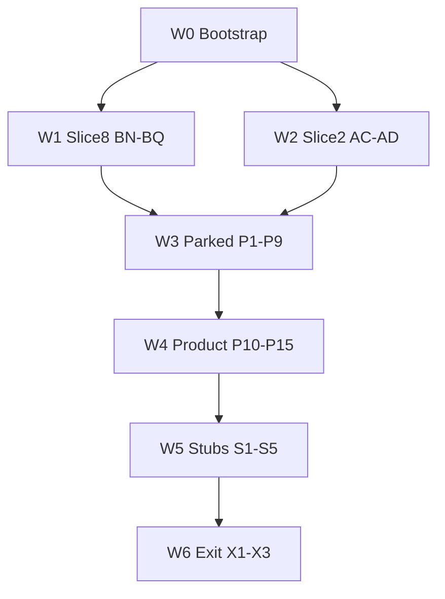

# Production Remaining Work — Master Execution Plan

**Document type:** Fresh-chat **master index** for the **Production Remaining Work** track (Owner web close-out + parked wire-ups + single-store product notes + real POS integrations).  
**Source of truth:** [`PROJECT_MASTER_PLAN.md`](PROJECT_MASTER_PLAN.md)  
**Live progress context:** [`Current_Status.md`](Current_Status.md)  
**API catalog:** [`Completed_API_lists.md`](Completed_API_lists.md)  
**RBAC contract:** [`ROLES_AND_PERMISSIONS.md`](ROLES_AND_PERMISSIONS.md)  
**Authorized plan:** Production Remaining Work (2026-09-18) — replaces the Remaining Work Freeze for **in-scope** product items.  
**Freeze archive (docs-only history):** [`REMAINING_WORK_EXECUTION.md`](REMAINING_WORK_EXECUTION.md) — **DONE**; do not authorize freeze batches A–D again.

**Status of this track:** **IN PROGRESS** — **Waves 0–4 DONE** 2026-09-18; next = `Authorize Prod Batch S1` ([`PROD_WAVE_5_STUBS_EXECUTION.md`](PROD_WAVE_5_STUBS_EXECUTION.md)).
**Prerequisite:** Milestone 0–**5** DONE. M6 Slices 1–8 **DONE** (incl. BM–BQ). Slice 2 **P–AD DONE**.

**Do not start from this file alone:** any wave/batch without explicit `Authorize …`.  
**Never build from this track:** bi-directional sync · n8n webhooks · Postgres RLS · Manager web · M7 (multi-branch, transfers, Super Admin, enterprise RBAC) · Baki / on-account tender.

---

## Child execution files (attach the active wave only)

| Wave | File | Batches | Purpose |
|------|------|---------|---------|
| **0** | [`PROD_WAVE_0_BOOTSTRAP_EXECUTION.md`](PROD_WAVE_0_BOOTSTRAP_EXECUTION.md) | **W0A–W0C** | BM verify, reopen gated work, status board — **DONE** 2026-09-18 |
| **1** | [`M6_SLICE_6_EXECUTION.md`](M6_SLICE_6_EXECUTION.md) | **BN → BQ** | Slice 8 Settings / Account / Help / exit — **DONE** 2026-09-18 |
| **2** | [`MILESTONE_6_EXECUTION.md`](MILESTONE_6_EXECUTION.md) | **AC → AD** | Manifest Details + Slice 2 exit (existing M6 batches) |
| **3** | [`PROD_WAVE_3_PARKED_EXECUTION.md`](PROD_WAVE_3_PARKED_EXECUTION.md) | **P1–P9** | Parked Owner/desktop wire-ups (invent UI + existing/new APIs) |
| **4** | [`PROD_WAVE_4_PRODUCT_EXECUTION.md`](PROD_WAVE_4_PRODUCT_EXECUTION.md) | **P10–P15** | Cash count, presence, cloud holds, desktop cloud txns, catalog import, drafts |
| **5** | [`PROD_WAVE_5_STUBS_EXECUTION.md`](PROD_WAVE_5_STUBS_EXECUTION.md) | **S1–S5** | Kill accepted stubs: PIN → Print → MFS → Card → Loyalty OTP |
| **6** | [`PROD_WAVE_6_EXIT_EXECUTION.md`](PROD_WAVE_6_EXIT_EXECUTION.md) | **X1–X3** | Composed smoke, doc sync, pilot runbook, retire stub board |

### Side enhancement tracks (optional — not Production waves)

| Track | File | Batches | Purpose |
|-------|------|---------|---------|
| **Dashboard Intelligence** | [`ENHANCE_DASHBOARD_INTELLIGENCE_EXECUTION.md`](ENHANCE_DASHBOARD_INTELLIGENCE_EXECUTION.md) | **D1–D4** | Owner Dashboard clickable KPIs, product demand / low-sell report, sale-priority stock alarms, design upgrade — **DONE** (2026-09-19; `smoke:enhance-dash-intel`). Does **not** replace Wave 5. **Never invent Baki.** |

**Always attach** this master file + `Current_Status.md` + `PROJECT_MASTER_PLAN.md` + `ROLES_AND_PERMISSIONS.md` + `Completed_API_lists.md` + the **active child** file.

---

## How to use (same ritual as prior milestones)

1. Open a **fresh Cursor chat** for **one** batch only.
2. `@` the files listed for that wave (see each child file header).
3. Paste **only** that batch’s **Agent prompt**, or say exactly:
   - `Authorize Prod Batch <ID>` (W0 / P* / S* / X*)
   - `Authorize M6 Batch BN` … `BQ` (Wave 1)
   - `Authorize M6 Batch AC` or `AD` (Wave 2)
4. Agent implements **only** that batch.
5. Agent pastes the **short report**. You review **YOU DO**.
6. Agent marks the batch checkbox / status / changelog in the active execution file (and other docs that batch lists). You confirm exit check.
7. Next batch only after the previous is green — **new chat**.

> **Hard rules:**
> - **One batch per chat.** Never collapse a whole wave.
> - **No invented KPI/table rows.** Live Prisma via Express.
> - **Payments:** `CASH` \| `CARD` \| `MFS` only. No Baki.
> - **Owner web** (`apps/web`) = **OWNER only**.
> - **Localization:** `t("...")` + `en.ts` + `bn-BD.ts` (web and/or desktop as applicable). Latin digits. Do not translate domain/runtime data. Receipt body language is **not** UI locale.
> - **POS keyboard:** arrows + Enter + Esc; **never** Tab-as-navigator. F6 Hold / F7 Held list unchanged unless a batch explicitly extends holds.
> - **Tenancy:** every query scoped by JWT `tenantId`.
> - **Stack lock:** Express + Prisma + Postgres · Tauri + React + SQLite · Zod in `@r2a/shared-types`. No MongoDB.
> - **Secrets:** never commit `.env`. Extend `.env.example` only.
> - **UI invent authorization (this track):** for production-track UI batches, default reply is **`invent to match theme`** (Admin Portal / Dashboard chrome). Agent still **asks once** on first UI message, then stops until you reply (`invent to match theme` \| `use prior upload` \| re-share). Wave 1–2 keep the existing M6 re-share protocol in their parent files.
> - Do **not** enable branch switcher, full Roles editor, Help tickets, or multi-branch as live features (honest disabled + hint only).

---

## Walkthrough + short-report protocol (mandatory)

| Kind | Who | What |
|------|-----|------|
| **Agent smoke** | Agent | Batch `smoke:*` when listed |
| **User review** | **You** | Short **YOU DO** list |

**Prod / Wave 0 / P / S / X report:**

```text
## Prod Batch <ID> report
Done: <1–3 bullets>
Smoke: PASS | FAIL | n/a — <script name>
YOU DO: <numbered, or none>
Next: Authorize <exact next command>
```

**M6 Wave 1–2 report:** use the existing `## M6 Batch <ID> report` format from the M6 parent file.

Do **not** start the next batch in the same chat.

---

## Locked decisions (production track)

| Topic | Lock |
|-------|------|
| Scope | Everything remaining **except** bi-di, n8n, RLS, Manager web, M7 |
| Stubs | **No more stubs.** Print, card, MFS, Manager PIN, loyalty OTP → **real** integrations (Wave 5) |
| MFS | Backend confirms with provider; desktop shows **status only**; cashier **never** enters Trx IDs ([`Current_Status.md`](Current_Status.md) §12 #20) |
| SMS / OTP | Direct SMS gateway adapter via env — **not** n8n |
| Card | Pluggable Tauri terminal adapter; vendor via env; void/compensate if ingest fails after auth |
| Print | Tauri `print_receipt` + ESC/POS from existing `ReceiptPrintModel`; paper width in desktop Settings |
| Manager PIN | `User.pinHash` + `POST /api/v1/auth/verify-pin`; Staff set/reset on Owner web; see [`ROLES_AND_PERMISSIONS.md`](ROLES_AND_PERMISSIONS.md) §9 |
| BM | Verify + document; **do not rebuild** if `smoke:m6bm` PASS |
| Intentionally disabled | Branch switcher · Settings Branch/Roles/Preferences/Security/Audit&Data cards (hints only in BN) · Help tickets · Baki |
| M6 milestone complete? | **No** after this track alone — bi-di / n8n / RLS / Manager web remain UNDONE by exclusion |

### Classification labels (status docs)

| Label | Meaning |
|-------|---------|
| **IN SCOPE (this track)** | Waves 0–6 batches below |
| **STILL DISABLED (honest)** | M7-gated or no-backend items — keep disabled with i18n hints |
| **OUT OF SCOPE** | bi-di · n8n · RLS · Manager web · M7 · Baki |
| **WAS ACCEPTED STUB** | Print / card / MFS / PIN / OTP — **retire** after Wave 5; do not leave as “accepted” |

---

## Full inventory (nothing omitted)

### A. Gated M6 product (Waves 1–2)

| Batch | What | Execution home |
|-------|------|----------------|
| **BN** | Settings nav + hub + Business Profile | [`M6_SLICE_6_EXECUTION.md`](M6_SLICE_6_EXECUTION.md) |
| **BO** | Account Profile + footer Owner Profile | same |
| **BP** | Help & Support (FAQ + status; tickets disabled) | same |
| **BQ** | Slice 8 exit · catalog §28 · `smoke:m6s8` | same |
| **AC** | Return Manifest Details + Dispatch / Decision / Complete | **DONE** 2026-09-18 — [`MILESTONE_6_EXECUTION.md`](MILESTONE_6_EXECUTION.md) |
| **AD** | Slice 2 exit · catalog §22 · `smoke:m6s2` | **DONE** 2026-09-18 — same |

### B. Former PARKED controls (Wave 3)

| Batch | What |
|-------|------|
| **P1** | Edit Customer — **DONE** 2026-09-18 |
| **P2** | Edit Supplier — **DONE** 2026-09-18 |
| **P3** | View All POs by supplier — **DONE** 2026-09-18 |
| **P4** | View All Products by supplier — **DONE** 2026-09-18 |
| **P5** | Inventory Report page — **DONE** 2026-09-18 |
| **P6** | Purchase Report page — **DONE** 2026-09-18 |
| **P7** | CSV Export on loaded Owner pages — **DONE** 2026-09-18 |
| **P8** | Desktop stock-audit count UI — **DONE** 2026-09-18 |
| **P9** | Review All Issues aggregator — **DONE** 2026-09-18 |

### C. Former “other deferred notes” + drafts (Wave 4)

| Batch | What |
|-------|------|
| **P10** | Request Cash Count — **DONE** 2026-09-18 |
| **P11** | Owner terminal presence (heartbeat + Owner web dots) — **DONE** 2026-09-18 |
| **P12** | Cloud / shared held sales (soft hold; local offline fallback) — **DONE** 2026-09-18 |
| **P13** | Desktop Transactions → cloud `GET /sales` (+ offline merge) — **DONE** 2026-09-18 |
| **P14** | CSV/Excel catalog import (Owner web) — **DONE** 2026-09-18 |
| **P15** | Save as Draft — GRN receive resume; Supplier/Manifest stay no-draft — **DONE** 2026-09-18 |

### D. Former ACCEPTED STUB (Wave 5) — production integrations

| Batch | What |
|-------|------|
| **S1** | Real Manager PIN (`pinHash` + verify) |
| **S2** | Real receipt print IPC (ESC/POS) |
| **S3** | Real MFS (intent + webhook + status UI) |
| **S4** | Real card terminal adapter |
| **S5** | Real loyalty OTP (SMS + verify token) |

### E. Exit (Wave 6)

| Batch | What |
|-------|------|
| **X1** | Composed `smoke:prod-exit` + package scripts |
| **X2** | Status / master plan / RBAC / API catalog sync; retire ACCEPTED STUB board |
| **X3** | Pilot runbook appendix (printer, MFS cutover, PIN, SMS) |

### F. Still DISABLED after this track (do not “fake live”)

Branch switcher · Settings hub cards Branch / Roles / Preferences / Security / Audit & Data (beyond BN hints) · Help **Create Ticket** / ticket inbox · Multi-branch · Manager web · Super Admin console.

### G. OUT OF SCOPE (never from this track)

Bi-directional sync · n8n (`workflows/`) · Postgres RLS · Manager web · M7 multi-branch / transfers / Super Admin / enterprise RBAC · Baki.

---

## Default wave order

```text
W0 (bootstrap) → W1 (BN→BQ) → W2 (AC→AD) → W3 (P1→P9) → W4 (P10→P15) → W5 (S1→S5) → W6 (X1→X3)
```

**Allowed reorder (after W0 only):** Wave 2 **before** Wave 1 if you want Slice 2 closed first. Say so when authorizing. Do **not** start Wave 3+ until W1 **and** W2 are DONE (unless you explicitly authorize a parallel parked batch — not recommended).



---

## Wave 1 bridge — Slice 8 (do not duplicate tasks here)

**Parent:** [`M6_SLICE_6_EXECUTION.md`](M6_SLICE_6_EXECUTION.md) Batches **BN → BO → BP → BQ**.  
**Prerequisite:** Wave 0 PASS (BM verified).  
**Production override:** UI invent allowed via `invent to match theme` after the mandatory ask-stop.  
**Order:** BN → BO → BP → BQ.  
**Next after BQ:** `Authorize M6 Batch AC` (or Wave 3 if Wave 2 already DONE).

### Fresh-chat template (Wave 1)

```text
@PROJECT_MASTER_PLAN.md @Current_Status.md @ROLES_AND_PERMISSIONS.md
@PRODUCTION_REMAINING_EXECUTION.md @M6_SLICE_6_EXECUTION.md @Completed_API_lists.md

Authorize M6 Batch BN.
Implement ONLY that batch. One batch only.
Production track: invent to match theme is allowed AFTER the re-share ask-stop.
When done, paste the short M6 Batch BN report.
```

Repeat for BO / BP / BQ.

---

## Wave 2 bridge — Slice 2 close (do not duplicate tasks here)

**Parent:** [`MILESTONE_6_EXECUTION.md`](MILESTONE_6_EXECUTION.md) Batches **AC → AD** (lifecycle spec in that file).  
**APIs:** Batch R already live (`/owner/return-manifests/*`).  
**Production override:** invent Manifest Details + Decision + Complete modals after ask-stop.  
**Order:** AC → AD (AD blocked on AC).  
**Next after AD:** Wave 3 `Authorize Prod Batch P1` (Wave 1 also DONE).

### Fresh-chat template (Wave 2)

```text
@PROJECT_MASTER_PLAN.md @Current_Status.md @ROLES_AND_PERMISSIONS.md
@PRODUCTION_REMAINING_EXECUTION.md @MILESTONE_6_EXECUTION.md @Completed_API_lists.md

Authorize M6 Batch AC.
Implement ONLY that batch. One batch only.
Production track: invent to match theme is allowed AFTER the re-share ask-stop.
When done, paste the short M6 Batch AC report.
```

---

## Suggested first commands

1. ~~`Authorize Prod Batch W0A`~~ — **DONE**
2. ~~`Authorize Prod Batch W0B`~~ — **DONE**
3. ~~`Authorize Prod Batch W0C`~~ — **DONE** (Wave 0 complete)
4. ~~`Authorize M6 Batch BN`~~ — **DONE**
5. ~~`Authorize M6 Batch BO`~~ — **DONE**
6. ~~`Authorize M6 Batch BP`~~ — **DONE**
7. ~~`Authorize M6 Batch BQ`~~ — **DONE** (Slice 8 / Wave 1 complete)
8. ~~`Authorize M6 Batch AC`~~ — **DONE**
9. ~~`Authorize M6 Batch AD`~~ — **DONE** (Wave 2 / Slice 2 complete)
10. ~~`Authorize Prod Batch P1`~~ — **DONE** (Wave 3 started)
11. ~~`Authorize Prod Batch P2`~~ — **DONE** (Edit Supplier)
12. ~~`Authorize Prod Batch P3`~~ — **DONE** (View All POs by supplier)
13. ~~`Authorize Prod Batch P4`~~ — **DONE** (View All Products by supplier)
14. ~~`Authorize Prod Batch P5`~~ — **DONE** (Inventory Report)
15. ~~`Authorize Prod Batch P6`~~ — **DONE** (Purchase Report)
16. ~~`Authorize Prod Batch P7`~~ — **DONE** (CSV Export on loaded pages)
17. ~~`Authorize Prod Batch P8`~~ — **DONE** (Desktop stock-audit count)
18. ~~`Authorize Prod Batch P9`~~ — **DONE** (Review All Issues; Wave 3 complete)
19. ~~`Authorize Prod Batch P10`~~ — **DONE** (Request Cash Count)
20. ~~`Authorize Prod Batch P11`~~ — **DONE** (Terminal presence)
21. ~~`Authorize Prod Batch P12`~~ — **DONE** (Cloud held sales)
22. ~~`Authorize Prod Batch P13`~~ — **DONE** (Desktop Transactions → cloud)
23. ~~`Authorize Prod Batch P14`~~ — **DONE** (CSV/Excel catalog import)
24. ~~`Authorize Prod Batch P15`~~ — **DONE** (Save as Draft GRN; Wave 4 complete)
25. `Authorize Prod Batch S1` — Real Manager PIN
26. After S5 PASS → `Authorize Prod Batch X1`

---

## Change log

| Date | Change |
|------|--------|
| 2026-09-19 | **Side track DONE:** Owner Dashboard Intelligence D1–D4 (`smoke:enhance-dash-intel` PASS). Production next unchanged = `Authorize Prod Batch S1`. |
| 2026-09-18 | **Side track authored:** [`ENHANCE_DASHBOARD_INTELLIGENCE_EXECUTION.md`](ENHANCE_DASHBOARD_INTELLIGENCE_EXECUTION.md) (D1–D4 Owner Dashboard Intelligence). Optional; does not replace Wave 5. Next Production = still `Authorize Prod Batch S1`; Enhance = `Authorize Enhance Batch D1`. |
| 2026-09-18 | **Prod Batch P15 / Wave 4 DONE.** GRN Save as Draft (`GoodsReceiptDraft` + receipt-draft APIs); receive resume; Supplier/Manifest drafts stay disabled with hints; `smoke:prod-p15` PASS. Next = `Authorize Prod Batch S1`. |
| 2026-09-18 | **Prod Batch P14 DONE.** Owner Catalog Import `/inventory/import` — CSV/XLSX dry-run + commit upsert by sku; OWNER `/owner/catalog/import/*`; `smoke:prod-p14` PASS. Next = `Authorize Prod Batch P15`. |
| 2026-09-18 | **Prod Batch P13 DONE.** Desktop Transactions → cloud `GET /sales` (+ `/:id`); online store-scoped list/detail + local-only merge; offline local log; Owner web Sales unchanged; `smoke:prod-p13` PASS. Next = `Authorize Prod Batch P14`. |
| 2026-09-18 | **Prod Batch P12 DONE.** Cloud soft held sales — `HeldSale` + cashier `/held-sales`; desktop online cloud / offline local + Go Online reconcile (cloud canonical); max 3 store-scoped; no stock reservation; `smoke:prod-p12` PASS. Next = `Authorize Prod Batch P13`. |
| 2026-09-18 | **Prod Batch P11 DONE.** Terminal presence heartbeat + Owner Dashboard dots; Force Offline continues heartbeat with flag; `smoke:prod-p11` PASS. Next was `Authorize Prod Batch P12`. |
| 2026-09-18 | **Prod Batch P10 DONE.** Request Cash Count — Shift `cashCount*` + OWNER request/cancel; Owner web modal; desktop poll/banner → close-shift; `smoke:prod-p10` PASS. Next = `Authorize Prod Batch P11`. |
| 2026-09-18 | **Prod Batch P9 / Wave 3 DONE.** Review All Issues `/suppliers/issues` from suppliers attention; invent to match theme; `smoke:prod-p9` PASS. Next = `Authorize Prod Batch P10`. |
| 2026-09-18 | **Prod Batch P8 DONE.** Desktop Settings → Stock Audit (OWNER/MANAGER); online start/lines/submit; invent to match theme; `smoke:prod-p8` PASS. Next was `Authorize Prod Batch P9`. |
| 2026-09-18 | **Prod Batch P7 DONE.** Client CSV export on Sales/Inventory/Purchase reports, Audit list+lines, Shift detail summary, Expiry Returns; Print stays disabled (S2); `smoke:prod-p7` PASS. Next was `Authorize Prod Batch P8`. |
| 2026-09-18 | **Prod Batch P6 DONE.** Purchase Report `/reports/purchasing` (compose PO list); invent to match theme; `smoke:prod-p6` PASS. Next was `Authorize Prod Batch P7`. |
| 2026-09-18 | **Prod Batch P5 DONE.** Inventory Report `/reports/inventory` (compose summary + inventory low/out + expiry); invent to match theme; `smoke:prod-p5` PASS. Next was `Authorize Prod Batch P6`. |
| 2026-09-18 | **Prod Batch P4 DONE.** Supplier Details View All Products → `/inventory?supplierId=…`; additive inventory `supplierId` (ACTIVE batches + PO lines); `smoke:prod-p4` PASS. Next was `Authorize Prod Batch P5`. |
| 2026-09-18 | **Prod Batch P3 DONE.** Supplier Details View All POs → `/purchasing?supplierId=…`; filter chip + clear; `smoke:prod-p3` PASS. Next was `Authorize Prod Batch P4`. |
| 2026-09-18 | **Prod Batch P2 DONE.** Edit Supplier `/suppliers/:id/edit`; PATCH status ACTIVE↔HOLD; `smoke:prod-p2` PASS. Next was `Authorize Prod Batch P3`. |
| 2026-09-18 | **Prod Batch P1 DONE.** Edit Customer `/customers/:id/edit`; `smoke:prod-p1` PASS. Next = `Authorize Prod Batch P2`. |
| 2026-09-18 | **M6 Batch AD / Wave 2 DONE.** Slice 2 exit (`smoke:m6s2` PASS). Next was `Authorize Prod Batch P1`. |
| 2026-09-18 | **M6 Batch AC DONE.** Manifest Details + Dispatch/Decision/Complete; `smoke:m6ac` PASS. Next was `Authorize M6 Batch AD`. |
| 2026-09-18 | **M6 Batch BQ / Wave 1 DONE.** Slice 8 exit (`smoke:m6s8` PASS). Next was `Authorize M6 Batch AC`. |
| 2026-09-18 | **M6 Batch BP DONE.** Help & Support + footer Help. Next = `Authorize M6 Batch BQ`. |
| 2026-09-18 | **M6 Batch BO DONE.** Account Profile + footer Owner Profile. Next was `Authorize M6 Batch BP`. |
| 2026-09-18 | **M6 Batch BN DONE.** Settings hub + Business Profile live. Next was `Authorize M6 Batch BO`. |
| 2026-09-18 | **Wave 0 DONE (W0A–W0C).** Next was `Authorize M6 Batch BN`. |
| 2026-09-18 | **W0A–W0B DONE.** BM verified (`smoke:m6bm` PASS); `Current_Status.md` production board live. Next was W0C. |
| 2026-09-18 | **Production Remaining Work track authored.** Master + Waves 0/3/4/5/6 execution files; Waves 1–2 bridge to existing M6 parents. Scope: close M6 product leftovers, parked wire-ups, product notes, kill POS stubs. Out of scope: bi-di, n8n, RLS, Manager web, M7. Next was `Authorize Prod Batch W0A`. |
