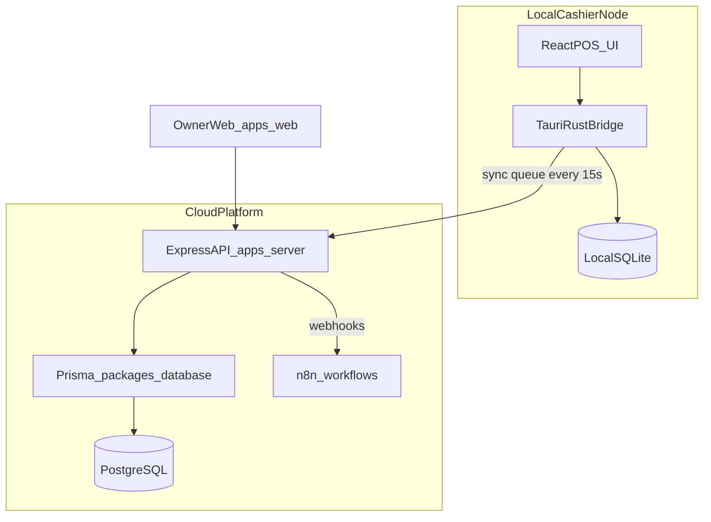

# R2A Pharmacy POS — Project Master Plan (AI Agent Context)

**Document type:** Single source of truth for Cursor agents and engineers  
**Project:** Multi-Tenant Pharmacy POS & Inventory SaaS  
**Version:** 1.0.0  
**Last updated:** 2026-08-21

> **How to use in a fresh chat:** Attach or `@` this file (`PROJECT_MASTER_PLAN.md`) plus relevant docs under `docs/`. Follow milestones in order. Do not introduce MongoDB, Mongoose, or any stack outside the Tech Stack below.

---

## 1. Product Goal

Build a production-grade, **offline-first**, multi-tenant Pharmacy Point of Sale and Inventory SaaS for Bangladesh / emerging markets:

- Sub-50ms local drug search / checkout feel
- Batch-wise expiry tracking with **FEFO** (First Expired, First Out)
- Multi-unit pricing (Box / Strip / Piece)
- Keyboard-first cashier POS
- Cloud PostgreSQL system of record + local SQLite on desktop
- n8n automation (WhatsApp / SMS refill alerts) from Phase 2 onward

### Detailed specs (source docs)

| Doc | Path |
|-----|------|
| Handover / stack contract | [docs/Project_Handover.md](docs/Project_Handover.md) |
| Product requirements (PRD) | [docs/Project_Requirement_Documents.md](docs/Project_Requirement_Documents.md) |
| System architecture | [docs/System_Architecture_Technical_Specification.md](docs/System_Architecture_Technical_Specification.md) |
| UI / UX specification | [docs/UX_Specification.md](docs/UX_Specification.md) |

---

## 2. Canonical Tech Stack (LOCKED)

| Layer | Technology |
|-------|------------|
| Monorepo | Turborepo + npm workspaces |
| Desktop | Tauri (Rust) + React + TypeScript + Vite |
| Web (owner) | React + TypeScript + Tailwind + Shadcn UI |
| Cloud API | Node.js + TypeScript + **Express** |
| ORM / Cloud DB | **Prisma** + **PostgreSQL** |
| Local offline DB | **SQLite** (`pos_local.db`) via Tauri |
| Automation | Self-hosted **n8n** + webhooks |
| Icons / UI | Lucide React, high-density clinical layout |

### Forbidden / removed stacks

Do **not** add or reintroduce:

- MongoDB, Mongoose, or any document-DB ORM
- Competing backend frameworks unless explicitly approved (stick to Express)
- Parallel frontend apps outside `apps/desktop` and `apps/web`

The previous Express + Mongoose scaffold (`r2a-pharma-backend`) was **deleted in Milestone 0**. Useful patterns to re-implement in TypeScript (Milestone 2):

- Module layering: `router → controller → service`
- API prefix `/api/v1`
- Helpers: `AppError`, `catchAsync`, `sendResponse` envelope
- Middleware shape: `protect` + `restrictTo` (extend with `tenantId` from JWT)

---

## 3. Monorepo Structure

```text
R2A-Pharmacy-POS/
├── apps/
│   ├── desktop/          # Tauri + React cashier POS
│   ├── web/              # Owner dashboard (Phase 2 UI focus)
│   └── server/           # Express + TS cloud API
├── packages/
│   ├── database/         # Prisma schema + migrations + client
│   │   └── prisma/
│   ├── shared-types/     # Zod DTOs / API + sync contracts
│   └── ui/               # Shared Tailwind / Shadcn components
├── workflows/            # n8n workflow JSON contracts (Phase 2)
├── docs/                 # PRD, Architecture, UX, Handover
├── package.json          # npm workspaces root
├── turbo.json
├── tsconfig.base.json
├── .env.example
└── PROJECT_MASTER_PLAN.md   # THIS FILE
```

### Workspace package names

| Package | npm name |
|---------|----------|
| Cloud API | `@r2a/server` |
| Desktop POS | `@r2a/desktop` |
| Owner web | `@r2a/web` |
| Prisma DB | `@r2a/database` |
| Shared types | `@r2a/shared-types` |
| Shared UI | `@r2a/ui` |

---

## 4. Architecture Blueprint



### Multi-tenancy (locked)

- Shared PostgreSQL with **`tenant_id`** on every domain table
- JWT must embed `tenantId` (and usually `storeId`, `role`, `sub`)
- Every cloud query scoped by `tenant_id` from JWT — never from client body alone
- Postgres RLS policies: Phase 2 defense-in-depth
- Phase 1 MVP: tenant-ready schema, single-store per tenant operations

### Offline sync (locked)

Local queue table:

```sql
CREATE TABLE outbound_sync_queue (
  id TEXT PRIMARY KEY,
  entity_type TEXT NOT NULL,
  action TEXT NOT NULL,
  payload TEXT NOT NULL,
  synced INTEGER DEFAULT 0,
  created_at DATETIME DEFAULT CURRENT_TIMESTAMP
);
```

Conflict rules:

- **Sales / invoices:** append-only, immutable
- **Stock:** delta sync only (`quantity_change`), never absolute overwrite
- Background worker pings cloud every **15s** and flushes FIFO

---

## 5. Non-Negotiable Business Rules

1. **FEFO:** POS recommends the nearest-expiring **non-expired** batch with stock > 0 (search card + Select Batch highlight). Expired lots may still appear in the batch picker but are not sellable. Manual override of FEFO needs permission (later). Cloud `GET …/fefo-batch` / ingest FEFO-fill pick earliest in-stock by expiry (may include expired) — desktop sellable preference is documented in `Completed_API_lists.md` §8.5.
2. **Multi-unit pricing:** Store quantities in lowest unit (e.g. tablets). Convert Box/Strip/Piece at billing. Example: 1 Box = 10 Strips = 100 Tablets.
3. **Keyboard-first POS:** Must work without a mouse.
   - `Ctrl+K` / `/` — focus search  
   - `F2` — new bill  
   - `F4` — generic substitution modal  
   - `F6` — Hold / park active sale  
   - `F7` — Held sales list (toggle)  
   - `F8` — customer / loyalty  
   - `Enter` / `F10` — complete sale + print  
   - `Esc` — clear cart / close modal  
   - `←` `→` (or `↑` `↓` on CTAs) — switch focused modal actions  
   - **`Tab` is never a POS navigator** — ignore Figma Tab hints; use arrows instead
4. **RBAC:**
   - **Cashier:** blocked from margins, base price edits, deleting sales, admin reports
   - **Owner:** full financials, reports, n8n settings
   - Later: Manager, Super Admin (Phase 3)

### UX design tokens (cashier)

- Primary: Teal `#0D9488`
- Accent: Indigo `#4F46E5`
- Background: Slate-50 `#F8FAFC`
- Night: Slate-900 `#0F172A`
- Expiry badges: red ≤30d, yellow ≤90d, green >90d
- Layout: 3-panel POS — search ~40% | cart + checkout ~60% (**locked**; do not follow Figma that shrinks the cart — see `Current_Status.md` §12 Active Cart lock)

---

## 6. Core Domain Model (Prisma — Milestone 1)

Minimum entities:

`Tenant`, `Store`, `User`, `Product`, `ProductUnit`, `Batch`, `Customer`, `Sale`, `SaleItem`, `Payment`

Plus sync ingest identity (`event_id` / idempotency) for offline events.

Roles (pharmacy, not marketplace): `SUPER_ADMIN` | `OWNER` | `MANAGER` | `CASHIER`

---

## 7. Milestone Execution Plan

Track status in this table. Agents must only implement the milestone the user authorizes.

| ID | Milestone | Status | Summary |
|----|-----------|--------|---------|
| M0 | Workspace hygiene | **DONE** | Turborepo scaffold, gitignore, docs/, delete Mongo backend |
| M1 | Database foundation | **DONE** | Prisma schema, migrations, seed, `@r2a/shared-types` |
| M2 | Cloud API core | **DONE** | Express TS auth, tenant guard, inventory, FEFO, sales ingest |
| M3 | Desktop POS shell | **DONE** | Slice 1–6; later screens → Slice 7+. See `MILESTONE_3_EXECUTION.md` |
| M4 | One-way sync | **DONE** | Batches A–F (queue IPC + `/sync/ingest` + offline complete + 15s worker + Sync Queue UI + catalog §19) |
| M5 | MVP hardening | **DONE** | RBAC E2E, Receive stock, 409 copy, paged catalog, print stub, `smoke:m5`, runbook |
| M6 | Growth (Phase 2) | IN PROGRESS | Slices 1–8 **DONE** (Slice 2 P–AD exit **DONE**). **Production track** 2026-09-18: [`PRODUCTION_REMAINING_EXECUTION.md`](PRODUCTION_REMAINING_EXECUTION.md) — Waves 0–4 **DONE**; next **Wave 5 S1–S5**; Wave 6 exit. Out of scope still: bi-di, n8n, RLS, Manager web. See also `MILESTONE_6_EXECUTION.md` + `M6_SLICE_6_EXECUTION.md`. |
| M7 | Scale (Phase 3) | PENDING | Multi-branch, transfers, enterprise RBAC |

---

### Milestone 0 — Workspace hygiene (DONE)

Completed:

- [x] Root Turborepo + npm workspaces (`package.json`, `turbo.json`, `tsconfig.base.json`)
- [x] Apps placeholders: `apps/desktop`, `apps/server`, `apps/web`
- [x] Packages placeholders: `packages/database`, `packages/shared-types`, `packages/ui`
- [x] `workflows/` for future n8n contracts
- [x] `.gitignore`, `.env.example`
- [x] Specs moved to `docs/`
- [x] **Deleted** `r2a-pharma-backend` (MongoDB/Mongoose) and empty `r2a-pharma-frontend`
- [x] This master plan file created

---

### Milestone 1 — Monorepo & Database Foundation (DONE)

Completed:

- [x] Create full `packages/database/prisma/schema.prisma` (entities above + indexes on `tenantId`, search fields, batch expiry)
- [x] Create `packages/shared-types` Zod schemas (auth, product, sale, sync event)
- [x] Seed: owner user + sample drug catalog / batches
- [x] Env: `DATABASE_URL`, `JWT_SECRET` (see `.env.example`)

**Exit:** `prisma migrate` applies; seed loads tenant/store/products/batches. **Met.**

---

### Milestone 2 — Cloud API Core (`apps/server`) (DONE)

Detailed batches: [`MILESTONE_2_EXECUTION.md`](MILESTONE_2_EXECUTION.md) (A–H all green).  
API catalog: [`Completed_API_lists.md`](Completed_API_lists.md).

Completed:

- [x] Express + TypeScript; mount `/api/v1`; modular `router → controller → service`
- [x] Port patterns: `AppError`, `catchAsync`, `sendResponse`, `protect`, `restrictTo`
- [x] JWT payload: `{ sub, role, tenantId, storeId }` (+ hashed rotatable refresh tokens)
- [x] Tenant context middleware on all domain routes
- [x] CRUD: Products, Batches, Customers; staff create via `POST /api/v1/users`
- [x] `POST /api/v1/sales/ingest` + FEFO helper (`expiryDate` / `quantityOnHand`; optional `batchId`)
- [x] Generic substitute lookup by active ingredient
- [x] Health endpoint + structured logging (pino)
- [x] Response envelope: `{ status, message, data?, meta? }` (not `{ success: false, error: {...} }`)
- [x] Exit smoke: `npm run smoke:m2 -w @r2a/server` (13/13)

Out of M2 product surface (unchanged): Super Admin platform console; M4 `/sync/ingest`; Baki tender.

**Exit:** Authenticated sale ingest with FEFO; cashier cannot see margins. **Met** (2026-08-09).

---

### Milestone 3 — Desktop POS Shell (`apps/desktop`) (DONE)

Detailed batches: [`MILESTONE_3_EXECUTION.md`](MILESTONE_3_EXECUTION.md) (Slice 1–6; closed 2026-08-13 — user all-screens-done; later finds → Slice 7+).

- Tauri + Vite + React + TS + Tailwind + Shadcn (`@r2a/ui`)
- 3-panel layout per UX spec
- Full keyboard map
- Online: Cloud API; Offline: SQLite + queue
- Header online/offline sync badge
- Thermal print stub (80mm / 58mm preview) — real Tauri IPC still TODO

**Completed so far:**

- [x] Batch A: `@r2a/desktop` runnable (Vite + Tauri 2); Tailwind; `@r2a/ui` bootstrap; `VITE_API_BASE_URL`
- [x] Batch B: design tokens + AppShell chrome (Search Results - Napa)
- [x] Batch C: invented login + session (M2 auth/refresh/me); Logout wired; Counter Ready placeholder
- [x] Batch D: connectivity badge + online/offline mode (health probe)
- [x] Batch E: `pos_local.db` + lean catalog cache + `outbound_sync_queue`; IPC; online cache pull; pending count wired
- [x] Batch F–I: Counter Ready → Empty POS → Search → Select Batch
- [x] Batch J: Quantity & Packaging modal; stock-aware Piece/Strip/Box; Add → cart line
- [x] Batch K: Active Cart table (~40/60); Edit + Del; Clear/Cancel ConfirmDialog; Proceed toast only
- [x] Batch L: Slice 1 exit verification
- [x] Batch M: Edit Sale Item modal; Change Batch stub (Batch N)
- [x] Batch N: Change Batch (edit) + Manual FEFO Override warn; Request Auth stub (Batch O)
- [x] Batch O: Manager Authorization stub; stages FEFO override for Batch P
- [x] Batch P: Override Authorized Edit + cart Override badge/toast; `fefoOverride` on cart line
- [x] Batch Q: Remove Item Confirm (reusable ConfirmDialog)
- [x] Batch R: Select Customer F8 (no Baki; Create removed in AF; walk-in; M2 search)
- [x] Batch S: Redeem Loyalty + OTP stub (Continue without = right primary; any 6-digit OTP)
- [x] Batch T: Complete Sale zero-pay + Sale Completed + loyalty calc (ingest CASH ৳0)
- [x] Batch U: Slice 2 exit + `Completed_API_lists.md` §14
- [x] Batch V–Y: Payment Select Method + Cash + shared Sale Completed + print stub
- [x] Batch Z: Slice 3 exit + `Completed_API_lists.md` §15 + `smoke:m3z`
- [x] Batch AA: Receipt Preview (80/58, dynamic lines; Settings pharmacy header from AH)
- [x] Batch AB–AC: Card Payment stub + CARD ingest + Sale Completed Card
- [x] Batch AD: MFS bKash/Nagad/Rocket + invented confirm + MFS ingest
- [x] Batch AE: Slice 4 exit + `Completed_API_lists.md` §16 + `smoke:m3ae`
- [x] Batch AF: Create Customer removed from POS; `POST /customers` OWNER-only
- [x] Batch AG: Generic Substitutes [F4]
- [x] Batch AH: Settings Pharmacy / Receipt Header → Receipt Preview
- [x] Batch AI: Force Offline / Stay Offline (sticky)
- [x] Batch AJ–AK: Transactions List + Detail + Reprint (local log)
- [x] Batch AL: Shift Open/Close + Counter Ready; Slice 5 exit + §17 + `smoke:m3al`; soft gate New Sale on open shift
- [x] Batch AM: `heldSaleStore` + `HeldSaleSnapshot`; max 3 soft holds; localStorage; no Hold UI
- [x] Batch AN: Hold F6 + cart Hold / Held n/3; Held Sales list resume/discard; empty New Sale after park; stub recheck toast
- [x] Batch AO: soft resume recheck (strip/clamp); Hold aborts card/MFS stubs + epoch-guards ingest
- [x] Batch AP: Slice 6 exit + `Completed_API_lists.md` §18 + `smoke:m3ap`; **F7** Held list toggle

**Still later (hardening / deferred / next milestones):** real printer IPC, real card SDK, real MFS APIs (backend-confirmed status; no cashier Trx), cloud sales list / cloud shift API, Owner web Create Customer, 409 conflict copy (M5 D). Later POS screens → Slice 7+ when shared.

**Exit:** Keyboard checkout **online** **Met**. Local catalog cache + outbound queue **table** **Met**. Queue **flush** is **M4** (**Met** 2026-08-14). User closed M3 screens 2026-08-13.

---

### Milestone 4 — One-way Sync Worker (DONE)

Detailed batches: [`MILESTONE_4_EXECUTION.md`](MILESTONE_4_EXECUTION.md) (A–F all green; closed 2026-08-14).  
API catalog: [`Completed_API_lists.md`](Completed_API_lists.md) §19.

- [x] Tauri/desktop worker every 15s → flush `outbound_sync_queue` FIFO
- [x] Cloud `POST /api/v1/sync/ingest` — append-only sales + stock deltas, idempotent by `event_id`
- [x] Retry / backoff / dead-letter for poison events
- [x] Sync Queue panel (badge + Settings; no new sidebar)
- [x] Offline complete → same Sale Completed; online path still `/sales/ingest`

**Exit:** Offline sale appears in Postgres after reconnect with no duplicates. **Met** (2026-08-14; user reconnect walkthrough **PASS**).

---

### Milestone 5 — MVP Hardening & Pilot Ready (DONE)

Detailed batches: [`MILESTONE_5_EXECUTION.md`](MILESTONE_5_EXECUTION.md) (A–F all green; closed 2026-08-14).  
API catalog: [`Completed_API_lists.md`](Completed_API_lists.md) §20.  
Runbook: [`docs/DEV_RUNBOOK.md`](docs/DEV_RUNBOOK.md).

- [x] Owner vs Cashier RBAC end-to-end (`PATCH` customers/batches OWNER+MANAGER)
- [x] Purchase / stock entry for batches (desktop Settings; Owner/Manager)
- [x] Cash + Card + MFS only (fully settled; **no** on-account tender)
- [x] Receipt path: **print stub** in M5 (real IPC later — user lock)
- [x] Pre-loaded drug master usable at counter (paged catalog pull; no CSV)
- [x] Smoke tests: auth, FEFO, sync ingest + `smoke:m5`
- [x] Dev runbook (Postgres Docker / Neon, desktop build)

**MVP ship gate:** Single-store pharmacy sells online/offline with FEFO; cloud holds sales (owner UI can wait for M6). **Met** (2026-08-14).

---

### Milestone 6 — Growth (PRD Phase 2)

Detailed batches (Slice 1 **A–O DONE**, Slice 2 **P–AD DONE**, Slice 3 **AE–AM DONE**, Slice 4 Staff **AN–AV DONE**, Slice 5 **AW–BD DONE**, Slice 6 **BE–BG DONE**, Slice 7 **BH–BL DONE**, Slice 8 **BM–BQ DONE**): [`MILESTONE_6_EXECUTION.md`](MILESTONE_6_EXECUTION.md) + [`M6_SLICE_6_EXECUTION.md`](M6_SLICE_6_EXECUTION.md). Owner Web Missing Features [`WEB_MISSING_FEATURES_PLAN.md`](WEB_MISSING_FEATURES_PLAN.md) — **W1–W6 DONE**. Full M6 is **not** complete (production Waves 3–6 + out-of-scope items remain).

- Bi-directional sync (cloud catalog/stock → local)
- Loyalty points earn/redeem — ingest snapshots live (M6 D); refill events later
- Supplier return bucket (≈90 days to expiry)
- API webhooks → n8n (WhatsApp/SMS, PO dispatch)
- `apps/web` Owner Web Slice 1 — OWNER login/chrome, Dashboard, Sales/Transaction Details, Inventory, Product Add/Edit/Details, Receive Stock, audited Batch Management, and Expiry Management are live
- `apps/web` Owner Web Slice 2 — Supplier/PO/GRN/return APIs (Q–R), Purchasing list + Create Purchase Order + PO Details + Receive against PO (T–W), Suppliers directory (X), Add Supplier (Y), Supplier Details (Z), Expiry Returns (AA), Create Return Manifest (AB), Manifest Details + lifecycle modals (AC), and Slice 2 exit (AD) **DONE**
- `apps/web` Owner Web Slice 3 — **AE–AM DONE** (customer schema + Zod, role-aware APIs, Customers nav, directory, Add Customer, Customer Details, Registration Review + Approve/Reject, POS Create, Slice 3 exit)
- `apps/web` Owner Web Slice 4 — **Staff AN–AV DONE** — list/add/details/edit + deactivate/reactivate; email login; temp password on create; composed Staff smoke `smoke:m6av`
- `apps/web` Owner Web Slice 5 — **AW–BD DONE** (cloud shift, desktop cloud shift, Shift Management, Shift Details, Review Cash Variance, Reports Dashboard)
- M6 Slice 6 — **BE–BG DONE**: OWNER-only Sales Report aggregate API (`GET /owner/reports/sales`) + shared Zod; Sales Report UI live at `/reports/sales`; catalog §26 + composed `smoke:m6s6`
- **Side enhancement (not a Production wave):** Owner Dashboard Intelligence D1–D4 **DONE** — clickable KPIs, `GET /owner/reports/product-movement`, `GET /owner/reports/stock-priority`, catalog §26A/§26B; composed `smoke:enhance-dash-intel` — [`ENHANCE_DASHBOARD_INTELLIGENCE_EXECUTION.md`](ENHANCE_DASHBOARD_INTELLIGENCE_EXECUTION.md)
- M6 Slice 7 — **BH–BL DONE**: StockAudit / StockAuditLine / StockAuditActivityEvent / FefoViolationRecord schema, shared Zod `audit.ts`, deterministic demo seed, live audit/FEFO APIs, sale ingest FEFO violation hook, Owner web Audit & FEFO dashboard at `/audit`, live Audit Details at `/audit/:auditId` with Review/Approve/Reject modal, and FEFO manual stock correction modal; composed `smoke:m6s7` PASS.
- Desktop manual stock correction uses online signed deltas with reason, optimistic version, idempotent event ID, and authoritative catalog refresh; general batch PATCH never changes quantity
- Postgres RLS policies

---

### Milestone 7 — Scale (PRD Phase 3)

- Multi-branch under one tenant; inter-branch stock transfer
- Fine-grained RBAC (Manager, Super Admin platform)
- AI / analytics summaries via n8n; supplier B2B hooks

---

## 8. Agent Operating Rules

1. **Milestone gating:** Only implement the milestone the user explicitly authorizes.
2. **Stack fidelity:** Prisma + PostgreSQL + SQLite + Express + Tauri + React only.
3. **Tenant safety:** Never trust client-supplied `tenantId` without JWT verification.
4. **Sync safety:** Never overwrite stock with absolute counts from offline nodes.
5. **POS UX:** Prefer keyboard paths; keep clinical high-density layout.
6. **Scope control:** No drive-by refactors or unrelated docs unless asked.
7. **Secrets:** Never commit `.env`; use `.env.example` only.

---

## 9. Suggested Next Command to the Agent

```text
Follow @PROJECT_MASTER_PLAN.md @Current_Status.md @ROLES_AND_PERMISSIONS.md
@PRODUCTION_REMAINING_EXECUTION.md @MILESTONE_6_EXECUTION.md @Completed_API_lists.md
M0–M5 are DONE. M6 production track is active. Waves 0–4 DONE. Next = Authorize Prod Batch S1.
Do not start P* / S* / M7 / bi-di / n8n / RLS / Manager web from the master plan alone.
```

M0–M5 are complete. **M6 Owner Web Slices 1–8 DONE** (BM–BQ; Slice 2 P–AD exit DONE). Production Remaining Work **Waves 0–4 DONE** (2026-09-18). Next = `Authorize Prod Batch S1` (Real Manager PIN). See [`PRODUCTION_REMAINING_EXECUTION.md`](PRODUCTION_REMAINING_EXECUTION.md) + [`PROD_WAVE_5_STUBS_EXECUTION.md`](PROD_WAVE_5_STUBS_EXECUTION.md). **Side enhancement DONE:** Owner Dashboard Intelligence D1–D4 — [`ENHANCE_DASHBOARD_INTELLIGENCE_EXECUTION.md`](ENHANCE_DASHBOARD_INTELLIGENCE_EXECUTION.md) (`smoke:enhance-dash-intel`); does not replace Wave 5; **never invent Baki**. **M7 is PENDING.** Do not start bi-di / n8n / RLS / Manager web / M7 from the master plan alone.

---

## 10. Progress Log

| Date | Change |
|------|--------|
| 2026-09-19 | **Enhance Dashboard Intelligence D1–D4 DONE** — clickable KPIs, product movement, stock priority; catalog §26A/§26B; `smoke:enhance-dash-intel` PASS. Production next remains S1. |
| 2026-09-18 | **Enhance track authored** — [`ENHANCE_DASHBOARD_INTELLIGENCE_EXECUTION.md`](ENHANCE_DASHBOARD_INTELLIGENCE_EXECUTION.md) (D1–D4 Owner Dashboard Intelligence). Side track; Production next remains S1. |
| 2026-09-18 | **Prod Batch P15 / Wave 4 DONE** — GRN Save as Draft + policy; `smoke:prod-p15` PASS. Next = `Authorize Prod Batch S1`. |
| 2026-09-18 | **Prod Batch P14 DONE** — Owner Catalog Import `/inventory/import`; CSV/XLSX dry-run + commit; `smoke:prod-p14` PASS. Next = `Authorize Prod Batch P15`. |
| 2026-09-18 | **Prod Batch P13 DONE** — Desktop Transactions → cloud `GET /sales` (+ `/:id`); online store-scoped + local-only merge; offline local log; `smoke:prod-p13` PASS. Next = `Authorize Prod Batch P14`. |
| 2026-09-18 | **Prod Batch P12 DONE** — Cloud soft held sales (`HeldSale` + `/held-sales`); desktop online/offline + reconcile; `smoke:prod-p12` PASS. Next = `Authorize Prod Batch P13`. |
| 2026-09-18 | **Prod Batch P11 DONE** — Terminal presence heartbeat + Owner Dashboard Terminals card; Force Offline keeps heartbeat with flag; `smoke:prod-p11` PASS. Next was `Authorize Prod Batch P12`. |
| 2026-09-18 | **Prod Batch P10 DONE** — Request Cash Count (Shift `cashCount*` + OWNER request/cancel; Owner web modal; desktop banner → close-shift); `smoke:prod-p10` PASS. Next = `Authorize Prod Batch P11`. |
| 2026-09-18 | **Prod Batch P9 / Wave 3 DONE** — Review All Issues `/suppliers/issues` (compose suppliers attention); invent to match theme; `smoke:prod-p9` PASS. Next = `Authorize Prod Batch P10`. |
| 2026-09-18 | **Prod Batch P8 DONE** — Desktop Settings → Stock Audit (OWNER/MANAGER); online start/lines/submit; invent to match theme; `smoke:prod-p8` PASS. Next was `Authorize Prod Batch P9`. |
| 2026-09-18 | **Prod Batch P7 DONE** — Client CSV export on Sales/Inventory/Purchase reports, Audit list+lines, Shift detail, Expiry Returns; Print stays disabled (S2); `smoke:prod-p7` PASS. Next was `Authorize Prod Batch P8`. |
| 2026-09-18 | **Prod Batch P6 DONE** — Purchase Report `/reports/purchasing` (compose `GET /owner/purchase-orders`; no new API); invent to match theme; `smoke:prod-p6` PASS. Next was `Authorize Prod Batch P7`. |
| 2026-09-18 | **Prod Batch P5 DONE** — Inventory Report `/reports/inventory` (compose inventory-summary + inventory low/out + expiry; no new API); invent to match theme; `smoke:prod-p5` PASS. Next was `Authorize Prod Batch P6`. |
| 2026-09-18 | **Prod Batch P4 DONE** — Supplier Details View All Products → `/inventory?supplierId=…`; additive `supplierId` on `GET /owner/inventory` (ACTIVE batches + PO lines); `smoke:prod-p4` PASS. Next was `Authorize Prod Batch P5`. |
| 2026-09-18 | **Prod Batch P3 DONE** — Supplier Details View All POs → `/purchasing?supplierId=…`; web PO list client sends `supplierId`; filter chip + clear; `smoke:prod-p3` PASS. Next was `Authorize Prod Batch P4`. |
| 2026-09-18 | **Prod Batch P2 DONE** — Owner web Edit Supplier `/suppliers/:id/edit`; PATCH ACTIVE↔HOLD (+ DRAFT if already); `smoke:prod-p2` PASS. Next was `Authorize Prod Batch P3`. |
| 2026-09-18 | **Prod Batch P1 DONE** — Owner web Edit Customer `/customers/:id/edit`; PATCH additive DOB/gender/address + ACTIVE↔INACTIVE; `smoke:prod-p1` PASS. Next was `Authorize Prod Batch P2`. |
| 2026-09-18 | **M6 Batch AD / Slice 2 DONE** — catalog §22; `smoke:m6s2` PASS; Wave 2 complete. Next was `Authorize Prod Batch P1`. |
| 2026-09-18 | **M6 Batch AC DONE** — Return Manifest Details + Dispatch/Decision/Complete; `smoke:m6ac` PASS. Next was `Authorize M6 Batch AD`. |
| 2026-09-18 | **M6 Batch BQ / Slice 8 DONE** — catalog §28; `smoke:m6s8` PASS; Wave 1 complete. Next was `Authorize M6 Batch AC`. |
| 2026-09-18 | **M6 Batch BP DONE** — Help & Support + footer Help (`smoke:m6bp` PASS). Next = `Authorize M6 Batch BQ`. |
| 2026-09-18 | **M6 Batch BO DONE** — Account Profile + footer Owner Profile (`smoke:m6bo` PASS). Next was `Authorize M6 Batch BP`. |
| 2026-09-18 | **M6 Batch BN DONE** — Settings hub + Business Profile live (`smoke:m6bn` PASS). Next was `Authorize M6 Batch BO`. |
| 2026-09-18 | **Prod Wave 0 DONE (W0A–W0C).** BM verified; status board reopened; governance pointed at production track. Next was `Authorize M6 Batch BN`. |
| 2026-09-18 | **Production Remaining Work execution files authored** (master + Waves 0/3/4/5/6; Waves 1–2 bridge to M6 parents). Wave 0 bootstrap. |
| 2026-08-08 | Milestone 0 completed: Turborepo scaffold; docs relocated; Mongo/Mongoose backend removed; this master plan created |
| 2026-08-08 | Milestone 1 completed: Prisma + Neon migrate/seed + `@r2a/shared-types` |
| 2026-08-08 | M2 doc locks refined: Prisma field names, response envelope, staff create, FEFO optional `batchId`, Super Admin out of M2 product surface |
| 2026-08-09 | **Milestone 2 completed:** Express API auth/tenant/inventory/FEFO/sales ingest; smoke 13/13; next = M3 |
| 2026-08-09 | **M3 Batch A completed:** desktop Tauri 2 + Vite + React + Tailwind hello shell; next = Batch B chrome |
| 2026-08-09 | **M3 Batch C completed:** invented login + M2 session/refresh; next = Batch D connectivity |
| 2026-08-09 | **M3 Batch D completed:** connectivity badge + health probe + online/offline mode; next = Batch E SQLite |
| 2026-08-09 | **M3 Batch E completed:** pos_local.db + lean catalog/queue + cache pull; next = Batch F Counter Ready |
| 2026-08-09 | **M3 Batch F completed:** Counter Ready content + F2 → Empty POS placeholder; next = Batch G Empty POS |
| 2026-08-09 | **M3 Batch G completed:** Empty POS New Sale shell (search + empty cart body; Ctrl+K; Esc cancel); next = Batch H Search Results |
| 2026-08-09 | **M3 Batch H completed:** Search Results - Napa; next = Batch I Select Batch |
| 2026-08-09 | **M3 Batch I completed:** Select Batch (FEFO recommendation); next = Batch J Quantity |
| 2026-08-09 | **M3 Batch J completed:** Quantity & Packaging unit conversion; next = Batch K Cart |
| 2026-08-11 | **M3 Batch K completed:** Current Sale / Active Cart; next = Batch L exit |
| 2026-08-11 | **M3 Slice 1 completed:** Batch L exit verification; next = Slice 2 |
| 2026-08-11 | **M3 Batch M completed:** Edit Sale Item modal; next = Batch N |
| 2026-08-11 | **M3 Batch N completed:** Change Batch modal + FEFO override warn; next = Batch O |
| 2026-08-11 | **M3 Batch O completed:** Manager Authorization stub; next = Batch P |
| 2026-08-11 | **M3 Batch P completed:** Override Authorized Edit + cart Override badge/toast; next = Batch Q |
| 2026-08-11 | **M3 Batch Q completed:** Remove Item Confirm dialog; next = Batch R |
| 2026-08-11 | **M3 Batch R completed:** Select Customer F8; next = Batch S |
| 2026-08-11 | **M3 Batch S completed:** Redeem Loyalty + OTP stub; next = Batch T |
| 2026-08-11 | **M3 Batch T completed:** Complete Sale zero-pay + Sale Completed; next = Batch U |
| 2026-08-11 | **M3 Slice 2 completed:** Batch U exit; next = Slice 3 |
| 2026-08-11 | **M3 Batch V completed:** Payment Select Method; next = Batch W |
| 2026-08-11 | **M3 Batch W completed:** Cash Payment modal; next = Batch X |
| 2026-08-11 | **M3 Batch X completed:** Sale Completed cash settlement; next = Batch Y |
| 2026-08-11 | **M3 Batch Y completed:** Print stub states; next = Batch Z |
| 2026-08-11 | **M3 Slice 3 completed:** Batch Z exit; next = Slice 4 |
| 2026-08-12 | **M3 Batch AA completed:** Receipt Preview (80/58); next = Batch AB |
| 2026-08-12 | **M3 Batch AB completed:** Card Payment stub; next = Batch AC |
| 2026-08-12 | **M3 Batch AC completed:** Sale Completed Card; next = Batch AD |
| 2026-08-12 | **M3 Batch AD completed:** MFS bKash/Nagad/Rocket + invented confirm; next = Batch AE |
| 2026-08-12 | **M3 Slice 4 completed:** Batch AE exit; next = Slice 5 |
| 2026-08-12 | **M3 Batch AF completed:** Create Customer removed from POS; POST customers OWNER-only; next = Batch AG |
| 2026-08-12 | **M3 Batch AG completed:** Generic Substitutes [F4]; next = Batch AH |
| 2026-08-12 | **M3 Batch AH completed:** Settings Pharmacy / Receipt Header; next = Batch AI |
| 2026-08-12 | **M3 Batch AI completed:** Force Offline / Stay Offline; next = Batch AJ |
| 2026-08-12 | **M3 Batch AJ completed:** Transactions List; next = Batch AK |
| 2026-08-12 | **M3 Batch AK completed:** Transactions Detail + Reprint; next = Batch AL |
| 2026-08-12 | **M3 Batch AL completed:** Shift Open/Close; Slice 5 exit; next = Batch AM |
| 2026-08-13 | **M3 Batch AM completed:** heldSaleStore + HeldSaleSnapshot; next = Batch AN |
| 2026-08-13 | **M3 Batch AN completed:** Hold F6 + Held Sales list; next = Batch AO |
| 2026-08-13 | **M3 Batch AO completed:** soft resume recheck; Hold aborts card/MFS; next = Batch AP |
| 2026-08-13 | **M3 Batch AP completed:** Slice 6 exit; F7 Held list toggle; next = M4 |
| 2026-08-13 | **Milestone 3 completed:** POS shell closed; next = M4 when authorized |
| 2026-08-13 | **M4 Batch A completed:** queue schema + IPC + memory parity; next = Batch B |
| 2026-08-13 | **M4 Batch B completed:** POST /sync/ingest; next = Batch C |
| 2026-08-13 | **M4 Batch C completed:** offline complete → queue + local stock delta; next = Batch D |
| 2026-08-13 | **M4 Batch D completed:** 15s TS flush worker; next = Batch E |
| 2026-08-14 | **M4 Batch E completed:** Sync Queue panel; next = Batch F |
| 2026-08-14 | **Milestone 4 completed:** catalog §19; smoke:m4; user reconnect walkthrough PASS; next = M5 |
| 2026-08-14 | **M5 execution file created:** MILESTONE_5_EXECUTION.md; next = Authorize M5 Batch A |
| 2026-08-14 | **M5 Batch A completed:** PATCH customers/batches OWNER+MANAGER; next = Authorize M5 Batch B |
| 2026-08-14 | **M5 Batch B completed:** Settings Receive stock placeholder; next = Authorize M5 Batch C |
| 2026-08-14 | **M5 Batch C completed:** Settings Receive stock Add lot + Adjust qty; next = Authorize M5 Batch D |
| 2026-08-14 | **M5 Batch D completed:** Sync Queue Failed conflict copy; next = Authorize M5 Batch E |
| 2026-08-14 | **M5 Batch E completed:** paged catalogPull; next = Authorize M5 Batch F |
| 2026-08-14 | **Milestone 5 completed:** runbook; catalog §20; smoke:m5; user pilot PASS; M5 DONE; next = M6 |
| 2026-08-15 | **M6 Batch A completed:** @r2a/web Vite + Owner Login + OWNER session; next = Authorize M6 Batch B |
| 2026-08-15 | **M6 Batch B completed:** Owner chrome lock; next = Authorize M6 Batch C |
| 2026-08-15 | **M6 Batch C completed:** Additive Prisma (InventoryEvent + sale/product extras); next = Authorize M6 Batch D |
| 2026-08-15 | **M6 Batch D completed:** ingest receiptNo + cost snapshot + loyalty/FEFO + InventoryEvent; next = Authorize M6 Batch E |
| 2026-08-15 | **M6 Batch E completed:** GET /sales + GET /sales/:id; next = Authorize M6 Batch F |
| 2026-08-16 | **M6 Batch F completed:** GET /owner/dashboard + inventory-summary + expiry; next = Authorize M6 Batch G |
| 2026-08-16 | **M6 Batch G completed:** live Owner Dashboard; smoke:m6g; next = Authorize M6 Batch H |
| 2026-08-16 | **M6 Batch H completed:** live Sales Overview & Transactions; smoke:m6h; next = Authorize M6 Batch I |
| 2026-08-16 | **M6 Batch I completed:** live Transaction Details; smoke:m6i; next = Authorize M6 Batch J |
| 2026-08-16 | **M6 Batch J completed:** live Inventory list; smoke:m6j; next = Authorize M6 Batch K |
| 2026-08-16 | **M6 Batch K completed:** live Product Details; smoke:m6k; next = Authorize M6 Batch L |
| 2026-08-16 | **M6 Batch L completed:** live Add Product (POST /products + unit hierarchy Piece→Strip→Box + Rx, cold chain, reorder level, storage notes; 0 initial stock notice); smoke:m6l; next = Authorize M6 Batch M |
| 2026-08-16 | **M6 Batch M completed:** live web Receive Stock (POST /batches; product context + packaging/financial/stock impact); smoke:m6m; next = Authorize M6 Batch N |
| 2026-08-18 | **Owner Web Missing Features W1–W6 completed:** lifecycle/version/audit data foundation; historical sale snapshots; Edit Product; correction/signed-adjustment/void/retire APIs; localized Batch Management; desktop signed-adjustment compatibility; legacy absolute quantity PATCH removed; Batch N now eligible for separate authorization |
| 2026-08-18 | **M6 Batch N completed:** live Expiry Management with supplier/return metadata, filters, selection and CSV; Prepare Supplier Return remains disabled; smoke:m6n |
| 2026-08-18 | **M6 Batch O / Owner Web Slice 1 completed:** catalog §21 + composed smoke:m6s1 PASS; overall M6 remains IN PROGRESS; next = explicitly authorized Slice 2 |
| 2026-08-18 | **M6 Slice 2 planned:** P–AD (Purchasing, Suppliers, Expiry Returns, dedicated Create Manifest). Next = Authorize M6 Batch P |
| 2026-08-18 | **M6 Batch P completed:** additive Supplier/PO/GRN/ReturnManifest Prisma schema + shared Zod contracts; migration deployed; no routes/UI; smoke:m2 + smoke:m6s1 PASS; next = Authorize M6 Batch Q |
| 2026-08-18 | **M6 Batch Q completed:** OWNER-only Supplier CRUD and PO list/create/get/draft-update APIs; server PO numbers/totals/KPIs; no inventory effect; smoke:m6q 18/18 PASS; next = Authorize M6 Batch R |
| 2026-08-18 | **M6 Batch R completed:** OWNER-only GRN confirmation and return queue/manifest lifecycle APIs; receipt batches + RECEIVE events; partial/final PO progress; idempotent dispatch stock-out; smoke:m6r 17/17 PASS; next = Authorize M6 Batch S |
| 2026-08-18 | **M6 Batch S completed:** Purchasing and Suppliers sidebar routes enabled with localized placeholder shells; all other later nav remains disabled; no tables; smoke:m6s PASS; next = Authorize M6 Batch T |
| 2026-08-18 | **M6 Batch T completed:** live Purchasing list (KPI cards, PO table, search/status, pagination, CTAs); Create PO → /purchasing/new; smoke:m6t PASS; next = Authorize M6 Batch U |
| 2026-08-18 | **M6 Batch U completed:** live Create Purchase Order (ACTIVE-supplier dropdown, product line search w/ low-stock hint, Add Suggested Items, Save as Draft / Create SENT / Cancel, order-summary rail; no inventory effect); seed ships 3 ACTIVE suppliers (Beximco · Square · SMC); smoke:m6u PASS; next = Authorize M6 Batch V |
| 2026-08-19 | **M6 Batch V completed:** live Purchase Order Details (GET /owner/purchase-orders/:poId; header, KPIs, receiving progress, line received/remaining, GRN history; Export/Print/More disabled; Receive Stock → /purchasing/:poId/receive when remaining qty > 0 on SENT/partial; GRN form is Batch W); full purchasing.detail i18n; smoke:m6v PASS; next = Authorize M6 Batch W |
| 2026-08-19 | **M6 Batch W completed:** live Receive Stock against PO at `/purchasing/:poId/receive` (Receipt Details; Received Items table with + Add Batch / Lot #N rows, Valid/Incomplete/Exceeds status; Receipt Summary; Inventory Impact projection; Save as Draft disabled; Confirm → Batch R `POST /owner/purchase-orders/:poId/receipts` → back to PO Details; Inventory ad-hoc Receive untouched); full purchasing.receive i18n en + bn-BD; smoke:m6w PASS; next = Authorize M6 Batch X |
| 2026-08-19 | **M6 Batch X completed:** live Suppliers directory at `/suppliers` (4 KPI cards — Active Suppliers, Open POs, Purchases MTD w/ trend, Avg. Delivery Time; Supplier Directory card with search, status filter, SUPPLIER/CONTACT/ACTIVE PRODUCTS/LAST PURCHASE/OPEN POs/PURCHASES MTD table, pagination; 194px Supplier Attention rail — Overdue/Open/Expiry Return/On Hold with Review links to existing pages, Review All Issues disabled; Expiry Returns → /suppliers/returns, Add Supplier → /suppliers/new, Add form NOT built); `GET /owner/suppliers` extended additively with per-item stats + kpis + attention (m6q shape preserved); full suppliers i18n en + bn-BD; smoke:m6x PASS, smoke:m6s updated; next = Authorize M6 Batch Y |
| 2026-08-19 | **M6 Batch Y completed:** live Add Supplier form at `/suppliers/new` (invented to match the Admin Portal family — the shared Supplier Details screen is Batch Z): all `supplierCreateSchema` fields incl. preferred contact + expiry-returns window + lead time + ৳ min order value, live Setup Summary rail; suppliers always created ACTIVE — Save as Draft disabled, no Edit Supplier route; unsaved-changes guard; create → `POST /api/v1/owner/suppliers` → navigate to `/suppliers/:supplierId` (Details placeholder until Batch Z); new `createOwnerSupplier` client; full `suppliers.add.*` i18n en + bn-BD; superseded `suppliers.placeholder.new*` removed; smoke:m6y PASS, smoke:m6x updated; lint + build clean; next = Authorize M6 Batch Z |
| 2026-08-19 | **M6 Batch Z completed:** live Supplier Details at `/suppliers/:supplierId` (header name + status badge + contact line + Expiry Returns → `/suppliers/returns` + Create Purchase Order → `/purchasing/new`); honest KPI row — Purchases 12 Months, Avg. Delivery Time, Expiry Return Rate, Active Products — computed from live data (zeros/— when none; no invented ৳2,480,000 / 94% / 1.8% / 2.4 days); Supplier Information 2-col grid + Performance card (on-time / short supply / expiry accepted progress + avg credit note time); Purchase Orders table → `/purchasing/:poId`; Products Supplied table from batches + PO lines with live stock; View All POs / View All Products disabled (no supplier filter in Purchasing/Inventory); `GET /owner/suppliers/:supplierId` additively returns `detail` (kpis incl. openOrders + lastPurchaseAt, performance, purchaseOrders, products; m6q shape preserved); superseded `suppliers.placeholder.detail*` removed; full `suppliers.detail.*` i18n en + bn-BD; smoke:m6z PASS, smoke:m6x updated; server + web lint/build clean; next = Authorize M6 Batch AA |
| 2026-08-19 | **M6 Batch AA completed:** live Expiry Returns queue at `/suppliers/returns` (KPI cards, filters, Eligible-only selection, mixed-supplier lock; Create Return Manifest → `/suppliers/returns/new` without that layout; Inventory Prepare Supplier Return enabled; Export/Print disabled); additive `GET /owner/returns/queue` kpis + suppliers; smoke:m6aa PASS; next = Authorize M6 Batch AB |
| 2026-08-19 | **M6 Batch AB completed:** live Create Return Manifest at `/suppliers/returns/new` (queue draft + supplier policy + editable return qty; POST `/owner/return-manifests`; Save as Draft disabled; no stock movement); smoke:m6ab PASS; next was Batch AC |
| 2026-08-19 | **M6 Slice 2 AC–AD deferred. Slice 3 planned (AE–AM):** Owner web Customers + POS pending-approval registration. Next = Authorize M6 Batch AE |
| 2026-08-19 | **M6 Batch AE completed:** Customer Prisma status/source/profile + partial unique phone + Zod stubs + pending POS seed; POST still OWNER-only; next = Authorize M6 Batch AF |
| 2026-08-20 | **M6 Batch AF completed:** §23 Customer APIs (role-aware POST, Active-only GET, phone-check, Owner list/detail/approve/reject, ingest Active guard). **M6 Batch AG completed:** Customers sidebar is now a live chrome route with placeholder shells (`/customers`, `/customers/new`, `/customers/:id`, `/customers/:id/review`); Staff/Help/Owner Profile stay disabled; `smoke:m6ag` 5/5. Next = Authorize M6 Batch AH |
| 2026-08-20 | **M6 Batch AH completed:** live Customers directory at `/customers` from `GET /owner/customers` — KPI cards, All/Pending/Active/Inactive tabs, name-or-phone search, Status/Source/Sort filters, pagination; Pending row → `/customers/:id/review`, Active/Inactive → `/customers/:id`, Add Customer → `/customers/new` (form is AI); no invented 2,417 / ৳ totals; `smoke:m6ah` PASS. Next = Authorize M6 Batch AI |
| 2026-08-20 | **M6 Batch AI completed:** live Add Customer at `/customers/new` (UI_SPEC.md used): Customer Information form (name + phone required, email/DOB/gender/address optional) + debounced live `GET /customers/phone-check` Duplicate Check panel; Direct Customer Creation + read-only System Information (Source Owner Created, live Branch, live Created By); checkbox-gated **Create Confirm** modal (focus trap, summary, "What Happens After Creation" panel) → `POST /api/v1/customers` (OWNER → ACTIVE + OWNER_CREATED) → `/customers/:id` (Details is AJ); unsaved-changes guard; no sample data; `createCustomer` + `checkCustomerPhone` in `lib/customers.ts`; full `customers.add.*` i18n en + bn-BD; `smoke:m6ai` PASS, `smoke:m6ah` + `smoke:m6ag` still PASS, lint + build clean. Next = Authorize M6 Batch AJ |
| 2026-08-20 | **M6 Batch AJ completed:** live Customer Details at `/customers/:customerId` (UI_SPEC.md used): header name + status badge + contact line with **Edit Customer + More Actions disabled**; KPI cards — Loyalty Points, Total Purchases ৳, Visits, Last Purchase (all live, honest zeros/—); Customer Information 2-col grid (name, phone `tel:`, email `mailto:`, DOB, gender, status badge, address, live branch `storeName`); Registration Information card w/ audit notice + Source / Registration Branch / Submitted date+actor / Approved date+actor / Original Registration Values mini-cards; Purchase History (live sale rows → `/sales/:id`) + Loyalty Activity (Current Balance + earn/redeem rows with running balance from snapshots) bottom two-card row; right-rail Timeline Activity from known facts (approved / submitted, newest first); **PENDING_APPROVAL id redirects to `/customers/:id/review`** (Review stays AK placeholder); `GET /owner/customers/:id` additively returns `storeName`, `lastPurchaseAt`, `purchaseHistory.rows`, `loyaltyActivity.rows` (prior shape preserved); new `fetchCustomerDetail` + `CustomerDetail` types in `lib/customers.ts`; full `customers.detail.*` i18n en + bn-BD; `smoke:m6aj` PASS, `smoke:m6ai` + `smoke:m6ah` + `smoke:m6ag` still PASS, server + web lint + web build clean. Next = Authorize M6 Batch AK |
| 2026-08-20 | **M6 Batch AK completed:** live Customer Registration Review at `/customers/:customerId/review` (Review not re-shared; Admin Portal family used): breadcrumb Customers › Review Registration + Pending badge; read-only **Registration Request** card (Registered Name, Registered Phone `tel:`, Source POS Registration, live Branch `storeName`, Submitted date+time, live Submitted By actor) + **Review Profile** card (editable — Owner may correct name/phone/email/DOB/gender/address before approve; debounced live `GET /customers/phone-check` duplicate check that ignores this same customer and blocks approve when another customer owns the phone); right rail **Registration Info** + **Approval Action** copy; footer Cancel → list + **Reject Registration** (red outline) + **Approve Customer** (teal primary, disabled on validation/duplicate); shared **Approve Customer** modal (checkbox-gated, focus trap + Esc + focus return, Name/Phone/Branch/Source summary, teal "What Happens After Approval" panel) → `POST /api/v1/owner/customers/:id/approve` (OWNER only, pending only) → navigate to `/customers/:id` (Details shows Active); invented **Reject Registration** modal matching the Approve family (Registration Summary, optional rejection note ≤1000 chars, red checkbox-gated CTA) → `POST /api/v1/owner/customers/:id/reject` → navigate to `/customers` (row gone, phone reusable); Active/Inactive id on Review → redirects to Details (REJECTED rows are 404 → not-found state); unsaved-changes guard; no POS Create (Batch AL); `approveCustomer` + `rejectCustomer` + payload types in `lib/customers.ts`; full `customers.review.*` i18n en + bn-BD; `CustomersPlaceholder` removed; `smoke:m6ak` PASS (live pending→approve→POS Active-search flow already covered by `smoke:m6af`), `smoke:m6aj` + `smoke:m6ai` + `smoke:m6ah` + `smoke:m6ag` updated/still PASS, web lint + web build clean. Next = Authorize M6 Batch AL |
| 2026-08-21 | **M6 Batch AL completed:** live POS Create Customer modal (name + phone required, F3 shortcut, Arrow/Enter/Esc nav, Tab blocking, phone check, cashier pending / owner active registration); updated historical smokes; `smoke:m6al` PASS. Next = Authorize M6 Batch AM |
| 2026-08-21 | **M6 Batch AM completed:** Slice 3 exit; updated Completed API lists, created composed Slice 3 smoke runner script `smoke:m6s3`; updated status docs. Next = Authorize M6 Slice 4 (or AN) |
| 2026-08-21 | **M6 Batch AO completed:** Owner staff APIs (list, KPIs, detail, create w/ temp password, patch, deactivate, reactivate, block self actions, and lastLoginAt successful login update); smoke:m6ao PASS; next = Authorize M6 Batch AP |
| 2026-08-21 | **M6 Batch AP completed:** live Staff nav links and routes enabled with localized placeholders; smoke:m6ap PASS; next = Authorize M6 Batch AQ |
| 2026-08-21 | **M6 Batch AQ completed:** live Staff list directory with search, role filters, All/Active/Inactive tabs, KPI cards, derived username, formatted last active date, and pagination; full staff.* i18n; smoke:m6aq PASS; next = Authorize M6 Batch AR |
| 2026-08-21 | **M6 Batch AT completed:** live Edit Staff with prefill, read-only derived username, single-store branch lock, access-impact copy, self-edit redirect, `PATCH /owner/users/:id`, full i18n; smoke:m6at PASS |
| 2026-08-21 | **M6 Batch AV / Slice 4 completed:** Staff list/add/details/edit + deactivate/reactivate complete; composed `smoke:m6av` PASS; M6 remains IN PROGRESS with Slice 2 AC–AD deferred and later slices gated |
| 2026-08-22 | **M6 Batch AZ completed:** Owner web Staff → Shift Management button and live `/staff/shifts` list with KPIs/tabs/search/cashier filter; `smoke:m6az` PASS; next was Authorize M6 Batch BA |
| 2026-08-22 | **M6 Batch BA completed:** live `/staff/shifts/:shiftId` Shift Details for Open + Closed balanced states with OG content layout, cash/payment summaries, activity timeline, audit rail, and disabled Request Cash Count; `smoke:m6ba` PASS; next was Authorize M6 Batch BB |
| 2026-08-22 | **M6 Batch BB completed:** Review Cash Variance modal live from flagged shift list/detail; resolves via existing owner shift resolve route; resolved details show Variance Review card; Generate Shift Report remains disabled; `smoke:m6bb`, web lint, and web build PASS; next = Authorize M6 Batch BC |
| 2026-08-22 | **M6 Batch BC completed:** Reports nav live at `/reports`; Reports Dashboard composes existing OWNER-only dashboard/inventory-summary/purchase-orders/shifts APIs; Sales/Inventory/Purchase View Report disabled; `smoke:m6bc`, web lint, and web build PASS; next = Authorize M6 Batch BD |
| 2026-08-22 | **M6 Batch BD / Slice 5 EXIT completed:** `Completed_API_lists.md` §25 extended (BC Reports Dashboard + BD exit); composed `smoke:m6s5` registered and passing; status/master-plan/RBAC synchronized. **Slice 5 complete.** M6 remains IN PROGRESS (Slice 2 AC–AD deferred; Slice 6 Audit/Settings/Help/Owner Profile not started). Next = share/authorize Slice 6 or deferred Slice 2 AC |
| 2026-08-22 | **M6 Batch BE completed:** OWNER-only Sales Report API `GET /api/v1/owner/reports/sales` with shared Zod response, range filters, optional tenant-scoped `storeId`, prior-period trends, daily bars, payment summary, top category/cashiers/medicines, and recent transactions; `smoke:m6be` PASS. No UI; next = Authorize M6 Batch BF |
| 2026-08-22 | **M6 Batch BF completed:** Sales Report UI live at `/reports/sales`; Reports Dashboard Sales View Report enabled; branch display locked to current store, Last 30/7 Days range, Export disabled, top medicines and recent transactions from live API; `smoke:m6bf`, web lint, and web build PASS. Batch BG completed next. |
| 2026-08-22 | **M6 Batch BG / Slice 6 completed:** `Completed_API_lists.md` §26 added; composed `smoke:m6s6` registered and PASS; status docs synchronized. Slice 6 complete. Next was Authorize M6 Batch BH |
| 2026-08-22 | **M6 Batch BH completed:** StockAudit + FEFO violation Prisma schema/migration, shared Zod audit contracts, deterministic audit/FEFO seed; migrate + seed + `smoke:m2` PASS. No routes/UI. Next was Authorize M6 Batch BI |
| 2026-08-22 | **M6 Batch BI completed:** Audit + FEFO APIs live; manager/owner audit start/lines/submit, owner dashboard/list/detail/review/correct, and sale ingest FEFO violation hook; `smoke:m6bi` PASS. No web UI. Next was Authorize M6 Batch BJ |
| 2026-08-22 | **M6 Batch BJ completed:** Audit & FEFO nav live at `/audit`; dashboard uses live audit dashboard/list APIs plus existing expiry API; Generate Report disabled; detail links route to BK placeholder; `smoke:m6bj`, web lint, and web build PASS. Next = Authorize M6 Batch BK |
| 2026-09-10 | **M6 Batch BK completed:** live Audit Details at `/audit/:auditId` with KPI summary, line items table, variance calculation, timeline activity, Review & Action modal (Approve/Reject audit) with post-approval batch quantity adjustments, and FEFO Manual Stock Correction modal (`POST /api/v1/owner/fefo/correct-stock`); `smoke:m6bk`, web lint, and web build PASS. Next = Authorize M6 Batch BL |
| 2026-09-10 | **M6 Batch BL / Slice 7 EXIT completed:** `Completed_API_lists.md` §27 added (BH models, BI APIs, BJ dashboard, BK detail/modals, BL exit); `ROLES_AND_PERMISSIONS.md` updated with Audit & FEFO matrix rows and live routes; composed `smoke:m6s7` runner registered and PASS; status/master-plan docs synchronized. **Slice 7 complete.** Next = Authorize M6 Batch BM (Slice 8 Settings) |

